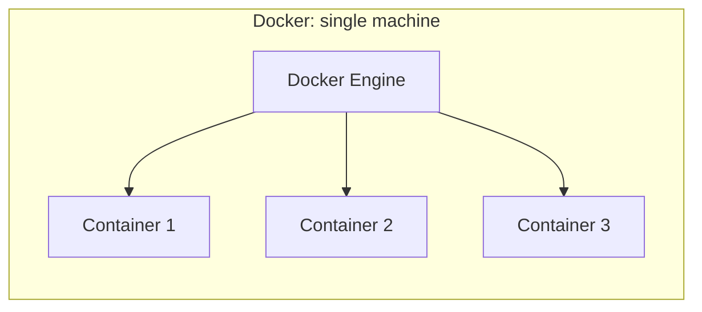
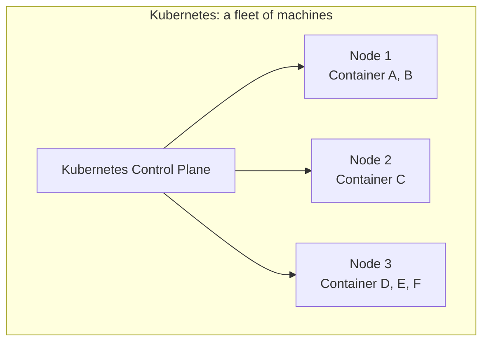
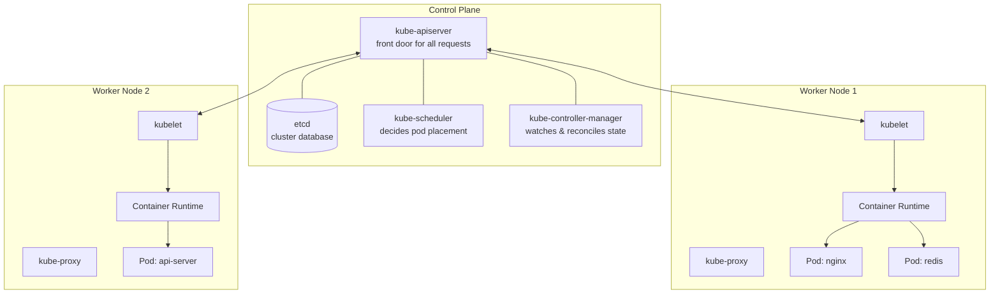
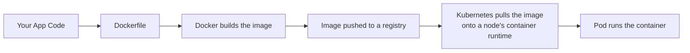
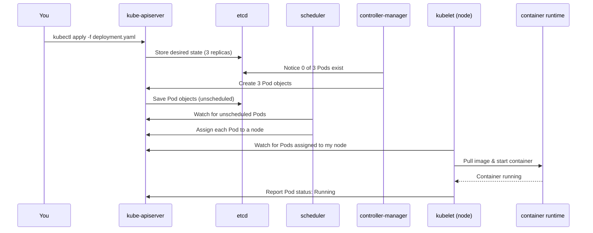

# Kubernetes Architecture & Purpose (vs. Docker)

A practical guide to what Kubernetes actually is, how it's built, and why it exists on top of — not instead of — Docker.

---

## 1. The Core Idea

**Docker** runs one or more containers on **one machine**.
**Kubernetes** runs containers across a **fleet of machines**, and keeps them running, scaled, and healthy without you babysitting them.





Docker answers: *"How do I package and run this app in an isolated environment?"*
Kubernetes answers: *"How do I run hundreds of these containers reliably, across many servers, and keep them alive when things fail?"*

---

## 2. Kubernetes Cluster Architecture

A Kubernetes cluster has two halves: the **Control Plane** (the brain) and **Worker Nodes** (the muscle).



### Control Plane components

| Component | What it does | Analogy |
|---|---|---|
| **kube-apiserver** | The only door into the cluster. Every `kubectl` command, every internal component, talks through it. | The receptionist / REST API front-end |
| **etcd** | A distributed key-value store holding the *entire* cluster state (what should exist, what does exist). | The single source of truth / database |
| **kube-scheduler** | Watches for newly created Pods with no node assigned, and picks the best node for them based on resources, constraints, affinity rules. | The dispatcher assigning jobs to workers |
| **kube-controller-manager** | Runs control loops that constantly compare *desired state* vs *actual state* and corrects drift (e.g. "3 replicas should exist, only 2 do → create one"). | The manager doing continuous inventory checks |

### Worker Node components

| Component | What it does |
|---|---|
| **kubelet** | An agent on every node that talks to the API server and makes sure the containers described for that node are actually running. |
| **kube-proxy** | Handles networking rules so traffic gets routed to the right Pod, even as Pods move between nodes. |
| **Container runtime** | The actual engine that runs containers — **this is where Docker (or containerd/CRI-O) lives**. Kubernetes doesn't replace Docker's job of running containers; it *orchestrates* it. |

---

## 3. Where Docker Fits Inside Kubernetes

This is the most common confusion, so it's worth being explicit:



- **Docker builds the box.** It packages your app + dependencies into an image.
- **Kubernetes decides where the box goes, how many copies exist, and what happens if one falls off a truck.**

Modern Kubernetes clusters typically use **containerd** (a lighter runtime, originally extracted from Docker) instead of the full Docker Engine to actually *run* containers — but you still build images with `docker build`, and the resulting image works the same either way.

---

## 4. Key Concepts, Compared Side by Side

| Concept | Docker | Kubernetes |
|---|---|---|
| Smallest unit | Container | **Pod** (one or more containers sharing network/storage) |
| Scaling | `docker run` more containers manually, or Docker Swarm | `kubectl scale` / Horizontal Pod Autoscaler — automatic |
| Self-healing | None built-in — a crashed container stays crashed unless you script a restart | Controllers automatically restart/reschedule failed Pods |
| Networking across hosts | Manual (custom bridge networks, overlay networks) | Built-in cluster networking; every Pod gets a routable IP |
| Load balancing | External tool needed (e.g. nginx, HAProxy) | Built-in via **Services** |
| Config/secrets | Env vars, bind-mounted files | **ConfigMaps** and **Secrets** as first-class objects |
| Rolling updates | Manual orchestration | Built-in via **Deployments** |
| Declarative state | `docker-compose.yml` (single host) | YAML manifests describing desired state, enforced cluster-wide |

---

## 5. A Concrete Example

### With Docker alone
```bash
docker run -d --name web1 -p 8080:80 nginx
docker run -d --name web2 -p 8081:80 nginx
```
If `web1` crashes, it's just... down. You'd need a cron job or a script watching `docker ps` to notice and restart it. If your one server dies, everything on it is gone. Scaling means SSH-ing in and running more `docker run` commands.

### With Kubernetes
```yaml
apiVersion: apps/v1
kind: Deployment
metadata:
  name: web
spec:
  replicas: 3
  selector:
    matchLabels:
      app: web
  template:
    metadata:
      labels:
        app: web
    spec:
      containers:
      - name: nginx
        image: nginx:latest
        ports:
        - containerPort: 80
---
apiVersion: v1
kind: Service
metadata:
  name: web-service
spec:
  selector:
    app: web
  ports:
  - port: 80
    targetPort: 80
  type: LoadBalancer
```
```bash
kubectl apply -f web-deployment.yaml
```

You declared: *"I always want 3 nginx Pods running, reachable through one load-balanced address."* Kubernetes now:
- Spreads the 3 Pods across different nodes
- Notices instantly if one dies and creates a replacement
- Load-balances traffic across whichever Pods are healthy right now
- Lets you scale with one command: `kubectl scale deployment web --replicas=10`
- Lets you update with zero downtime: `kubectl set image deployment/web nginx=nginx:1.27`

---

## 6. Request Flow: What Happens When You Run `kubectl apply`



Nothing here is imperative — you never told Kubernetes *how* to start containers. You told it the end state you wanted, and every component's job is to nudge reality toward that state, forever, in a loop.

---

## 7. When You Need Which

- **Just Docker**: local development, a single simple service, CI build steps, or you genuinely only ever need one host.
- **Kubernetes**: multiple services that need to talk to each other, need to survive a node dying, need to scale up/down with load, need zero-downtime deploys, or you're running this in production at any meaningful scale.

Kubernetes has real operational cost (more moving parts, a learning curve, cluster upkeep) — it's not "better than Docker," it solves a different, larger problem: *fleet management*, not *containerization* itself.

---

## Further Reading
- [kubernetes.io/docs/concepts](https://kubernetes.io/docs/concepts/)
- [Docker docs](https://docs.docker.com/)