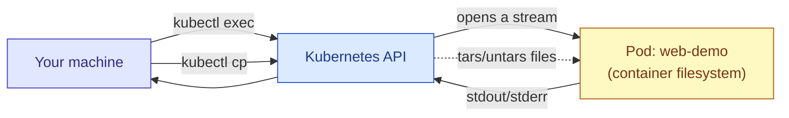

# `kubectl exec` and `kubectl cp`

## What They're For

Both let you reach *into* a running container directly useful for debugging, but not something you'd build an application workflow around.

| Command | Does what |
|---|---|
| `kubectl exec` | Runs a command **inside** a container, right now |
| `kubectl cp` | Copies files **between** your machine and a container's filesystem |



Both work by tunneling through the API server to the kubelet on the node — you don't need direct network access to the Pod itself.

---

## `kubectl exec`

### Basic Syntax

```bash
kubectl exec [-it] <pod-name> [-c <container-name>] -- <command>
#             |                |                        |
#             |                |                        └─ everything after "--"
#             |                |                           is the command to run
#             |                └─ only needed if the Pod has multiple containers
#             └─ -i = interactive (keep stdin open)
#                -t = allocate a TTY (needed for a usable shell)
```

### Examples

> Run a single, non-interactive command and see its output
```bash
kubectl exec web-demo -- ls /app
```
> Check an environment variable inside the container
```bash
kubectl exec web-demo -- env | grep APP_ENV
```
> Open an interactive shell — the most common use case
```bash
kubectl exec -it web-demo -- /bin/sh
```
> (use /bin/bash instead of /bin/sh if the image has bash installed)

> Target a specific container when the Pod has more than one
```bash
kubectl exec -it web-demo -c web-demo -- /bin/sh
```
> Check disk usage inside the container
```bash
kubectl exec web-demo -- df -h
```
> Test connectivity from INSIDE the Pod's network namespace —
> useful for confirming whether a Service is reachable from where
> your app actually runs, rather than from your own machine
```bash
kubectl exec web-demo -- wget -qO- http://web-demo-service
```

### What `exec` Cannot Do

- It only works if the container is **already running** and has a shell/binary available a `scratch`-based image with no shell can't be exec'd into meaningfully.
- It's not persistent anything you install or change inside the container via `exec` is **lost** the moment the container restarts.
- It's a debugging tool, not a deployment mechanism. Never build automation around live-patching containers with `exec`.

---

## `kubectl cp`

### Basic Syntax

```bash
kubectl cp <source> <destination> [-c <container-name>]
```
> One side is always local, the other is <pod-name>:<path-in-container>


### Examples


> Copy a file FROM your machine INTO the container
```bash
kubectl cp ./config.json web-demo:/app/config.json
```
> Copy a file FROM the container back to your machine
```bash
kubectl cp web-demo:/app/logs/app.log ./app.log
```
> Copy an entire directory
```bash
kubectl cp ./assets web-demo:/app/assets
```
> Specify a container when the Pod has more than one
```bash
kubectl cp ./config.json web-demo:/app/config.json -c web-demo
```
> Copy from a Pod in a different namespace
```bash
kubectl cp web-demo-config.json web-demo/web-demo:/app/config.json
```
>                                 |
>                                 └─ format is <namespace>/<pod-name>:<path>


### What `cp` Cannot Do

- It requires `tar` to be installed **inside the container** `kubectl cp` actually works by running `tar` inside the container over `exec` and streaming the archive. No `tar` in the image = `cp` fails outright.
- Like `exec`, anything you copy in is **lost on container restart** — it's not a substitute for a proper volume mount or `ConfigMap`/`Secret`.
- Not efficient for large files — it's fine for a config file or a log grab, not for moving gigabytes of data regularly.

---

## When to Reach for Something Else Instead

| If you need... | Use instead |
|---|---|
| Config injected reliably, every time the Pod starts | `ConfigMap` / `Secret` mounted as a volume |
| Files that persist across container restarts | A `PersistentVolumeClaim` |
| Ongoing log access | `kubectl logs`, or a proper log-shipping setup |
| Repeated file transfer as part of a real workflow | An init container, a sidecar, or object storage — not `cp` |

`exec` and `cp` are for **debugging a running system**, not for how a system is supposed to get its configuration or data in the first place.

## Quick Reference

```bash
kubectl exec -it web-demo -- /bin/sh       # interactive shell
kubectl exec web-demo -- <cmd>             # one-off command
kubectl cp ./file.txt web-demo:/tmp/       # copy in
kubectl cp web-demo:/tmp/file.txt ./       # copy out
```