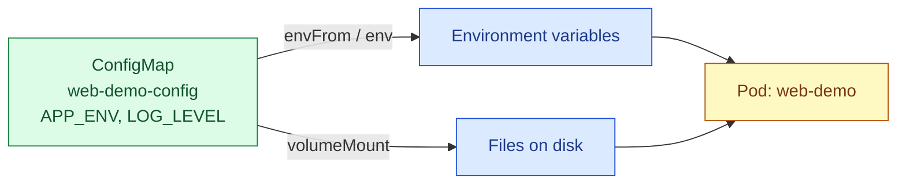

# Kubernetes ConfigMaps

## The Short Version

A **ConfigMap** holds non-sensitive configuration data as key-value pairs, kept separate from your container image. Change the config without rebuilding the image; reuse the same image across `dev`/`staging`/`prod` with different ConfigMaps.



There are two ways to get data from a ConfigMap into a container: as **environment variables**, or as **files mounted into the filesystem**. Same source, two different delivery mechanisms.

## Creating a ConfigMap

```yaml
apiVersion: v1
kind: ConfigMap                # ConfigMap has no `spec` it just uses `data`
                                # directly, since it's holding plain key-value pairs.
metadata:
  name: web-demo-config
data:
  APP_ENV: "production"         # simple key: value pairs become individual
  LOG_LEVEL: "info"              # environment variables when consumed via envFrom

  config.json: |                # the `|` preserves this as a multi-line string
    {                            # useful when you want to mount a whole file,
      "feature_flags": {         # not just a single env var
        "new_ui": true
      }
    }
```

> Create the same ConfigMap without writing YAML by hand
```bash
kubectl create configmap web-demo-config \
  --from-literal=APP_ENV=production \
  --from-literal=LOG_LEVEL=info
  ```
> Or build one directly from a file on disc
```bash
kubectl create configmap web-demo-config --from-file=config.json
```

## Option A: Consume as Environment Variables

```yaml
apiVersion: v1
kind: Pod
metadata:
  name: web-demo
spec:
  containers:
    - name: web-demo
      image: web-demo:1.0
      envFrom:                     # pulls in EVERY key in the ConfigMap as an
        - configMapRef:             # env var automatically no need to list
            name: web-demo-config   # each one individually

      # --- OR, if you only want ONE specific key, or want to rename it ---
      env:
        - name: LOG_LEVEL           # the env var name inside the container
          valueFrom:
            configMapKeyRef:
              name: web-demo-config  # which ConfigMap to read from
              key: LOG_LEVEL          # which key within it
```

## Option B: Consume as a Mounted File

```yaml
apiVersion: v1
kind: Pod
metadata:
  name: web-demo
spec:
  containers:
    - name: web-demo
      image: web-demo:1.0
      volumeMounts:
        - name: config-volume        # must match the volume name below
          mountPath: /app/config     # the ConfigMap's keys appear as FILES
                                      # inside this directory e.g. this Pod
                                      # will have /app/config/config.json
  volumes:
    - name: config-volume
      configMap:
        name: web-demo-config        # the ConfigMap to mount
```

## Env Vars vs. Mounted Files

| | Environment variables | Mounted files |
|---|---|---|
| Good for | Simple values (flags, log levels, URLs) | Whole config files (JSON, YAML, .env) |
| Updates on ConfigMap change | **Never** — requires a Pod restart | **Eventually** — kubelet syncs the file automatically, app must re-read it |
| Visibility | Shows up in `kubectl describe pod` / process env | Hidden unless you look at the file |

## Key Gotcha: Updates Don't Auto-Restart Anything

Editing a ConfigMap does **not** restart Pods that are already using it.

- If consumed as **env vars**: the running container never sees the change — you must manually restart the Pod (or roll the Deployment) to pick it up.
- If consumed as a **mounted file**: the file on disk updates automatically within about a minute, but your application still has to notice and re-read it — most apps don't watch config files for changes by default.

> Force a Deployment to pick up a ConfigMap change (env var case)
```bash
kubectl rollout restart deployment/web-demo
```

## ConfigMap vs. Secret

Use a **Secret** instead of a ConfigMap for anything sensitive (passwords, API keys, tokens) — same mechanics, but Secrets are base64-encoded at rest and can be restricted with RBAC more tightly. A ConfigMap is plain text, visible to anyone who can read it.

> inspect a ConfigMap
```bash
kubectl get configmap web-demo-config -o yaml   
```
          
> edit it live
```bash
kubectl edit configmap web-demo-config 
```