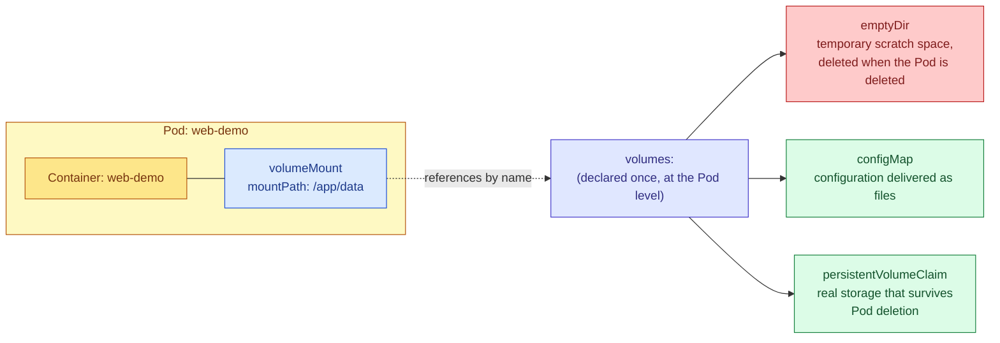

# Kubernetes Volumes and Volume Mounts

## Why Volumes Exist

When a container runs, it gets its own filesystem, built from the layers of its container image. That filesystem is not permanent. If the container crashes and Kubernetes restarts it, or if the Pod is deleted and a new one is scheduled to replace it, the container starts again from a completely clean copy of the image. Anything the application wrote to disk while it was running — log files, cached data, uploaded files, a local database file — is gone. This is true even though it might look, from inside the container, like a normal persistent disk.

A **Volume** is Kubernetes' answer to this problem. A Volume is a storage location that is defined at the Pod level, separately from any individual container, and then made available to one or more containers inside that Pod. Depending on which type of volume you choose, that storage might last exactly as long as the Pod does, or it might genuinely outlive the Pod and be reattached later. The point is that you, the person writing the manifest, get to choose how long the data should live and how it should be shared, rather than being stuck with whatever the container image happens to provide.



## The Two-Step Pattern You Will Always See

Every time you use a volume in Kubernetes, you are always doing two separate things, and it helps to keep them mentally distinct because they live in two different parts of the YAML file.

The first step happens under `volumes:`, which is a field on the **Pod's spec**, not on any individual container. This is where you declare that a piece of storage exists for this Pod, give it a name, and say what kind of storage it is — a temporary empty directory, a reference to a ConfigMap, a claim on real persistent disk, and so on.

The second step happens under `volumeMounts:`, which is a field on **each individual container** inside the Pod. This is where you say: for this particular container, take the volume with this name, and make its contents appear at this specific path inside the container's filesystem. A single volume, declared once at the Pod level, can be mounted into more than one container in the same Pod, at the same or different paths in each — this is exactly how two containers in one Pod share files with each other.

Because these are two separate declarations connected only by matching the `name` field between them, a very common source of failure is simply a typo: if the name under `volumeMounts` doesn't exactly match the name under `volumes`, the Pod will fail to start, and Kubernetes will tell you so in the Pod's events.

## Example: `emptyDir`, a Temporary Volume Shared Between Two Containers

An `emptyDir` volume is the simplest kind. When the Pod is scheduled onto a node, Kubernetes creates an empty directory for it. That directory exists for exactly as long as the Pod exists on that node. If the Pod is deleted, or if it moves to a different node for any reason, the directory and everything in it is destroyed permanently. This makes `emptyDir` useless for anything you actually need to keep, but genuinely useful for two situations: scratch space a single container needs temporarily, and sharing files between multiple containers that live in the same Pod.

In the example below, the Pod has two containers: the main application, and a second container whose job is to read log files and ship them somewhere else. Both containers mount the same `emptyDir` volume, at different paths, so that when the main application writes a log file, the log-shipping container can see it and read it.

```yaml
apiVersion: v1
kind: Pod
metadata:
  name: web-demo
spec:
  containers:
    - name: web-demo
      image: web-demo:1.0
      volumeMounts:
        - name: shared-logs
          # This is the path, inside THIS container, where the volume's
          # contents will appear. The application inside this container
          # would be configured to write its log files to this directory.
          mountPath: /app/logs

    - name: log-shipper
      image: log-shipper:1.0
      volumeMounts:
        - name: shared-logs
          # This is a SECOND container in the same Pod, mounting the exact
          # same volume by name. Because both containers are mounting the
          # same underlying storage, any file the web-demo container writes
          # to /app/logs will also be visible here, at this path, to the
          # log-shipper container. This is the standard pattern for a
          # "sidecar" container that ships logs, without the main
          # application needing to know anything about log shipping at all.
          mountPath: /var/log/incoming

  volumes:
    - name: shared-logs
      # emptyDir means: create a new, empty directory when this Pod starts.
      # It has no configuration required, which is why it's written as an
      # empty object here. Its contents are deleted permanently the moment
      # this Pod is deleted — there is no way to recover data from an
      # emptyDir volume after that happens, so never rely on it for
      # anything you actually need to keep.
      emptyDir: {}
```

## Example: Mounting a ConfigMap as Files on Disk

Sometimes an application expects to read its configuration from a file on disk, rather than from environment variables. Kubernetes lets you take a ConfigMap you've already created and mount it as a volume, in which case every key in that ConfigMap becomes an individual file inside the mounted directory, and the value of that key becomes the file's contents.

```yaml
apiVersion: v1
kind: Pod
metadata:
  name: web-demo
spec:
  containers:
    - name: web-demo
      image: web-demo:1.0
      volumeMounts:
        - name: config-volume
          # Every key inside the ConfigMap named "web-demo-config" will
          # show up as a separate file inside this directory. So if the
          # ConfigMap has a key called "config.json", the application
          # inside this container will be able to read it by opening
          # the file at /app/config/config.json, exactly as if it were
          # a normal file that had been baked into the image.
          mountPath: /app/config
          # Setting this volume mount to read-only is good practice here:
          # the application should never need to write back to its own
          # configuration files, so this prevents it from doing so even
          # by accident.
          readOnly: true
  volumes:
    - name: config-volume
      configMap:
        # This ConfigMap must already exist in the same namespace as this
        # Pod before the Pod is created, or the Pod will fail to start.
        name: web-demo-config
```

## Example: Real, Lasting Persistence with a PersistentVolumeClaim

The volume types above are either temporary (`emptyDir`) or tied to configuration data that lives elsewhere (`configMap`). Neither of them gives you what a database or a file-upload service actually needs: storage that is genuinely independent of any single Pod, so that if the Pod is deleted and a replacement is created, the replacement can pick up exactly where the old one left off, with all the same data still there.

This is what a **PersistentVolumeClaim**, usually abbreviated PVC, is for. A PVC is a request you make for a certain amount of storage. Depending on how the cluster is configured, that request is fulfilled either by a pre-existing disk that an administrator set up in advance, or, much more commonly on cloud providers, by automatically provisioning a new disk on demand (for example, an actual EBS volume on AWS, or a Persistent Disk on GCP). Once the claim exists and has been bound to some actual storage, you reference that claim from inside your Pod's volume definition, and Kubernetes handles attaching the correct disk to whichever node the Pod happens to be running on.

```yaml
apiVersion: v1
kind: PersistentVolumeClaim
metadata:
  name: web-demo-data
spec:
  accessModes:
    # ReadWriteOnce means this storage can be mounted as read-write by
    # a Pod on a single node at a time. This is the normal choice for
    # something like a single-instance database. Other access modes
    # exist (for example, ReadWriteMany, for storage that multiple
    # Pods on different nodes need to write to simultaneously), but
    # they require a storage backend that specifically supports them.
    - ReadWriteOnce
  resources:
    requests:
      # How much storage you're asking for. The actual disk that gets
      # provisioned will be at least this size.
      storage: 5Gi
---
apiVersion: v1
kind: Pod
metadata:
  name: web-demo
spec:
  containers:
    - name: web-demo
      image: web-demo:1.0
      volumeMounts:
        - name: data-volume
          # Anything the application writes to this path will be written
          # to the actual persistent disk behind the PVC. If this Pod is
          # deleted and Kubernetes creates a new Pod to replace it (for
          # example, because it's managed by a Deployment or StatefulSet),
          # the new Pod can mount the same PVC and will see all of the
          # same data that was written here before.
          mountPath: /app/data
  volumes:
    - name: data-volume
      persistentVolumeClaim:
        # This connects the Pod's volume to the PersistentVolumeClaim
        # defined above, by name.
        claimName: web-demo-data
```

## Comparing the Different Volume Types

It's worth being explicit about how long data actually lasts with each type, because this is the single most common point of confusion.

An **emptyDir** volume survives a container inside the Pod crashing and being restarted by the kubelet — the directory itself is tied to the Pod, not to any one container within it, so the data is still there after a container restart. However, it does not survive the Pod itself being deleted. Once the Pod is gone, the directory and everything inside it is gone too, with no way to get it back.

A **configMap** volume behaves a little differently, in the sense that the question "does it survive" doesn't quite apply the same way, because the data doesn't originate from anything the Pod itself wrote. The ConfigMap exists independently of the Pod, so mounting it doesn't create new data that could be lost — it just reflects whatever is currently in the ConfigMap. The same logic applies to a **secret** volume.

A **persistentVolumeClaim** volume is the one genuinely designed to survive both a container restart and full Pod deletion. This is why it's the correct choice for anything where losing the data would actually be a problem — a database's data directory, user-uploaded files, and so on.

A **hostPath** volume, which mounts a specific directory from the underlying node's own filesystem directly into the Pod, technically survives Pod deletion as well, but it comes with a serious caveat: the data is tied to that one specific node. If the Pod is later rescheduled onto a different node, it will not see the same data, because it's now looking at a different machine's filesystem entirely. For this reason, `hostPath` is generally discouraged for normal application workloads and is mostly reserved for specialized cluster infrastructure that genuinely needs access to node-level files.

## Mistakes Worth Watching For

The most frequent mistake is a simple mismatch between the name given under `volumeMounts` inside a container and the name given under `volumes` at the Pod level. Because these are just plain strings that Kubernetes matches against each other, a typo in either one means the container has no volume to mount, and the Pod will fail to start. When this happens, `kubectl describe pod` will show an event explaining that the referenced volume could not be found.

Another common mistake is assuming that data written to an `emptyDir` volume will survive if the Pod is deleted and recreated. It will not. If you find yourself reaching for `emptyDir` and then worrying about whether the data will still be there tomorrow, that's usually a sign you actually need a `PersistentVolumeClaim` instead.

A third mistake, easy to miss until it causes a confusing bug, is mounting a volume at a path where the container image already has files. When you mount a volume at a given path, the volume's contents completely replace whatever was there before at that exact path — anything that had been baked into the image at that location becomes invisible for as long as the volume is mounted there. If your container image ships a default configuration file at `/app/config/settings.json`, and you then mount an empty or differently-populated volume at `/app/config`, that default file will simply disappear from the running container's perspective.

## Checking What's Actually Mounted

Once a Pod is running, you can confirm what volumes are attached and where they're mounted by describing the Pod:

```bash
kubectl describe pod web-demo
```

This will include a `Volumes` section showing what each declared volume actually resolved to, and a `Mounts` line under each container listing the paths that container has mounted, which volume each one comes from, and whether it's read-only.

You can also look inside the running container directly to confirm the files are actually where you expect them to be:

```bash
kubectl exec web-demo -- ls -la /app/data
```