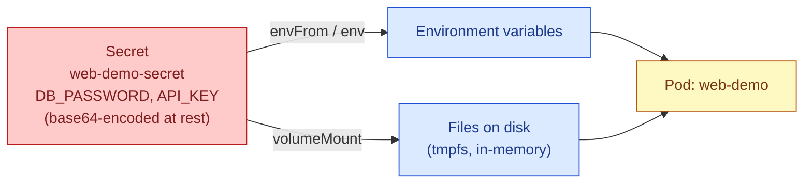

# Kubernetes Secret Management

## Why Secrets Are a Separate Object from ConfigMaps

A **Secret** in Kubernetes holds sensitive data — passwords, API keys, tokens, TLS certificates — and it is deliberately kept as its own distinct object type rather than just being "a ConfigMap for sensitive things." The two objects look almost identical in structure, and a Secret is not actually encrypted by default, only base64-encoded, which is a point worth understanding clearly rather than glossing over: base64 is an encoding, not encryption, and anyone with access to read the Secret object can trivially decode it back to plain text in a single command. The real value of a Secret being its own object type is that Kubernetes and the tools built around it treat Secrets differently in ways that matter for security: RBAC rules can grant access to ConfigMaps without granting access to Secrets, `kubectl get` does not print Secret values in plain text by default, and many clusters are configured to encrypt Secrets at rest in etcd even though ConfigMaps are not. None of this happens automatically just by calling something a Secret, though — you have to actually set up encryption at rest and RBAC restrictions for the extra protection to be real, which is something a lot of teams miss.



The mechanics of getting a Secret's data into a Pod are deliberately almost identical to how a ConfigMap works, because the whole design intention is that you should be able to swap one for the other with minimal changes to your Pod spec. Just like a ConfigMap, a Secret's values can be delivered to a container either as environment variables, or as files mounted into the container's filesystem. There is one meaningful difference in how the file-mounting version works underneath: when Kubernetes mounts a Secret as a volume, it uses an in-memory filesystem (tmpfs) rather than writing it to the node's actual disk, specifically so that the sensitive data is never persisted to disk on the node itself and disappears the moment the Pod is removed.

## Creating a Secret

You can define a Secret in YAML the same way you'd define a ConfigMap, but the values under `data` must be base64-encoded strings, not plain text. This trips a lot of people up the first time, because if you paste a plain-text password directly under `data`, Kubernetes will try to interpret it as if it were already base64, which usually fails or produces garbage.

```yaml
apiVersion: v1
kind: Secret
metadata:
  name: web-demo-secret
type: Opaque
# "Opaque" is the generic Secret type for arbitrary key-value data — the
# vast majority of Secrets you create yourself will use this type. Other
# built-in types exist for specific structured cases, such as
# "kubernetes.io/tls" for a TLS certificate and key pair, or
# "kubernetes.io/dockerconfigjson" for credentials used to pull images
# from a private container registry.
data:
  # Every value here must already be base64-encoded before it goes into
  # this file. This is NOT encryption — it is simply an encoding, and it
  # can be reversed by anyone with a single command, so treat this file
  # itself as sensitive and never commit it to version control.
  DB_PASSWORD: c3VwZXJzZWNyZXQxMjM=
  API_KEY: YWJjZGVmZ2hpams=
```

Because manually base64-encoding values by hand is error-prone and awkward, the far more common and recommended way to create a Secret is to let `kubectl` do the encoding for you, either from literal values typed directly on the command line, or from files on disk.

```bash
# Create a Secret directly from literal values — kubectl handles the
# base64 encoding automatically, so you type the real plain-text value
# here, not an already-encoded one.
kubectl create secret generic web-demo-secret \
  --from-literal=DB_PASSWORD=supersecret123 \
  --from-literal=API_KEY=abcdefghijk

# Create a Secret from the contents of files on disk — useful for
# certificates, private keys, or any file-based credential.
kubectl create secret generic web-demo-tls \
  --from-file=tls.crt=./server.crt \
  --from-file=tls.key=./server.key
```

If you do decide to write Secret manifests as YAML files that live in version control alongside the rest of your Kubernetes configuration, it's worth being deliberate about the fact that the actual sensitive values should not end up in that repository in plain or even base64 form. Tools such as Sealed Secrets, SOPS, or External Secrets Operator exist specifically to solve this problem, by letting you commit an encrypted or reference-only version of the Secret and have the real value populated into the cluster separately. That's a larger topic on its own, but it's worth knowing it exists before you get comfortable committing `kubectl create secret ... -o yaml > secret.yaml` output straight into git.

## Consuming a Secret as Environment Variables

```yaml
apiVersion: v1
kind: Pod
metadata:
  name: web-demo
spec:
  containers:
    - name: web-demo
      image: web-demo:1.0
      envFrom:
        # This pulls in every single key inside the Secret and exposes
        # each one as an environment variable with the same name, without
        # needing to list them individually. This is convenient, but it
        # also means that if someone later adds an unrelated key to this
        # Secret, it silently becomes available as an environment variable
        # in this container too, which is worth being aware of.
        - secretRef:
            name: web-demo-secret

      # If you would rather be explicit about exactly which keys are
      # exposed, and potentially rename them along the way, you can
      # reference individual keys instead, as shown here:
      env:
        - name: DATABASE_PASSWORD
          valueFrom:
            secretKeyRef:
              name: web-demo-secret
              key: DB_PASSWORD
```

## Consuming a Secret as a Mounted File

```yaml
apiVersion: v1
kind: Pod
metadata:
  name: web-demo
spec:
  containers:
    - name: web-demo
      image: web-demo:1.0
      volumeMounts:
        - name: secret-volume
          # Each key inside the Secret becomes an individual file inside
          # this directory, and the value of that key becomes the file's
          # contents. So a Secret with a key called "tls.crt" would appear
          # here as the file /app/certs/tls.crt.
          mountPath: /app/certs
          # This should almost always be read-only. The application has
          # no legitimate reason to write back to its own certificate or
          # credential files.
          readOnly: true
  volumes:
    - name: secret-volume
      secret:
        # This must reference a Secret that already exists in the same
        # namespace as this Pod before the Pod is created.
        secretName: web-demo-secret
```

## Why Environment Variables Are Often the Riskier Choice for Secrets

Although environment variables are the simpler and more common way to consume both ConfigMaps and Secrets, they come with a genuine downside specifically when the data is sensitive, and it's worth understanding why rather than just being told "files are safer" as an unexplained rule.

An environment variable set on a process is visible to that entire process and to anything with sufficient privilege to inspect it. On many systems, a process's environment variables can be read by looking at `/proc/<pid>/environ`, which means anyone who can exec into the container, or who has access to certain debugging tools, can potentially read the value directly. Environment variables also have a tendency to end up in places you didn't intend — they get dumped into crash reports, logged by error-handling middleware that logs the entire environment for debugging purposes, or printed accidentally by a library that logs its configuration at startup. A file mounted from a Secret doesn't eliminate these risks entirely, but it does avoid the specific problem of the value being copied into the process's environment and therefore into all of the places that environment tends to leak into. For this reason, many security-conscious setups prefer mounting Secrets as files, particularly for things like private keys and long-lived credentials, and reserve environment variables for less sensitive configuration.

## Updates to a Secret Do Not Automatically Restart Anything That Uses It

This behaves exactly the same way as a ConfigMap does, and it's worth restating clearly because it's easy to assume otherwise. If you edit a Secret that a Pod is already using, the running Pod does not automatically pick up the new value. If the Secret is being consumed as an environment variable, the container's environment was fixed at the moment the container started, and it will keep using the old value indefinitely until something forces the Pod to be recreated. If the Secret is being consumed as a mounted file, the kubelet will eventually update the file on disk inside the running container, typically within about a minute, but the application itself still has to notice that the file changed and re-read it, which most applications do not do automatically unless they were specifically written to watch for that.

```bash
# The most common way to force a Deployment's Pods to pick up a changed
# Secret when it's consumed as an environment variable — this creates new
# Pods with fresh environments, replacing the old ones.
kubectl rollout restart deployment/web-demo
```

## Secret Types Worth Knowing

Most Secrets you create yourself will be of the generic `Opaque` type, holding whatever arbitrary key-value pairs you need. But Kubernetes defines a handful of specific built-in Secret types for common structured cases, and it's worth knowing they exist so you use them instead of reinventing the same thing as a plain Opaque Secret.

A `kubernetes.io/tls` Secret is specifically structured to hold a TLS certificate and its corresponding private key, under the fixed keys `tls.crt` and `tls.key`. Many pieces of Kubernetes infrastructure, such as Ingress controllers handling HTTPS, expect a Secret in exactly this shape.

A `kubernetes.io/dockerconfigjson` Secret holds credentials for pulling container images from a private registry. Rather than manually constructing this, it's normally created with a dedicated command:

```bash
kubectl create secret docker-registry web-demo-registry-creds \
  --docker-server=registry.example.com \
  --docker-username=myuser \
  --docker-password=mypassword \
  --docker-email=me@example.com
```

Once created, a Secret of this type is referenced from a Pod's spec under `imagePullSecrets`, rather than being mounted or exposed as an environment variable, since its purpose is to authenticate the image pull itself rather than to configure the running application.

## Checking What's There Without Exposing the Value by Accident

`kubectl get secret` by default hides the actual values, which is intentional, but it's easy to accidentally reveal a Secret's contents while trying to inspect it if you're not careful about which command you run.

```bash
# This is safe — it shows the Secret's metadata and key names, but the
# values themselves are shown base64-encoded, not decoded.
kubectl get secret web-demo-secret -o yaml

# This decodes and prints ONE specific key's actual plain-text value —
# only run this deliberately, and be mindful of your terminal's scrollback
# and shell history afterward.
kubectl get secret web-demo-secret -o jsonpath='{.data.DB_PASSWORD}' | base64 --decode
```

## The Overall Point Worth Remembering

A Kubernetes Secret is best thought of as a mechanism for keeping sensitive values out of your container images and out of your plain configuration files, and for controlling which parts of the cluster are allowed to read them via RBAC — not as a strong cryptographic vault on its own. If you need genuinely strong protection at rest, in transit, and with proper access auditing, you generally need to pair Kubernetes Secrets with encryption at rest configured on the cluster itself, and often with an external secrets manager (such as HashiCorp Vault, AWS Secrets Manager, or similar) that Kubernetes pulls the real values from at runtime, rather than storing the sensitive values directly inside the cluster's own storage at all.