# Viewing Logs in Kubernetes

## Where Logs Actually Come From

When people say "check the logs" for a Kubernetes application, what they almost always mean is whatever the container's main process writes to its **standard output** and **standard error** streams — not a log file sitting somewhere inside the container's filesystem, even if the application itself happens to also be writing to a file internally. This distinction matters because it shapes how you should design an application to run well inside Kubernetes: the expectation is that your application writes its logs directly to stdout and stderr, and lets the container runtime and Kubernetes handle capturing, storing, and exposing that output, rather than the application managing its own log files, rotating them, and so on.

The container runtime on each node (commonly containerd) captures everything written to those two streams and writes it to a log file on the node's own disk, in a predictable location. The kubelet, which is the agent running on every node, knows where these files live for every container it's running, and it's the kubelet that actually serves the content back to you when you run `kubectl logs`, streaming from that file on disk through the API server and back to your terminal.

```mermaid
graph LR
    APP["Container process<br/>writes to stdout/stderr"]
    RUNTIME["Container runtime<br/>captures the streams"]
    DISK["Log file on the node's disk"]
    KUBELET["kubelet<br/>reads the file on request"]
    API["Kubernetes API"]
    YOU["kubectl logs<br/>(your terminal)"]

    APP --> RUNTIME --> DISK
    DISK --> KUBELET --> API --> YOU

    style APP fill:#fef9c3,stroke:#b45309,color:#78350f
    style RUNTIME fill:#dbeafe,stroke:#1d4ed8,color:#1e3a8a
    style DISK fill:#fecaca,stroke:#b91c1c,color:#7f1d1d
    style KUBELET fill:#dcfce7,stroke:#15803d,color:#14532d
    style API fill:#e0e7ff,stroke:#4338ca,color:#312e81
    style YOU fill:#dcfce7,stroke:#15803d,color:#14532d
```



This also explains one of the most important limitations to understand up front: these logs are only ever as durable as the node's disk and the container's own lifetime allow. If a Pod is deleted, or if it's rescheduled onto a different node, the log file that was sitting on the old node is gone, and there is no built-in mechanism in plain Kubernetes to get it back. This is exactly why any real production setup pairs Kubernetes with a separate, centralized logging system that continuously ships logs off of the node before they're lost — something covered further down.

## The Basic Command

```bash
# Print everything currently in the log file for this Pod's single container
kubectl logs web-demo
```

If the Pod only has one container, this is all you need, and Kubernetes figures out which container you mean automatically. The moment a Pod has more than one container, however, you have to say which one you're asking about, because there's no longer a single obvious answer.

```bash
# When a Pod has more than one container, you must specify which one's
# logs you want. Leaving this out when there are multiple containers
# will cause kubectl to return an error rather than guessing.
kubectl logs web-demo -c web-demo

# List the container names inside a Pod if you're not sure what they're
# called — useful before running the command above for the first time.
kubectl describe pod web-demo | grep -A2 "Containers:"
```

## Following Logs in Real Time

By default, `kubectl logs` prints whatever is currently in the log and then exits immediately, the same way `cat` would. If you're actively debugging something and want to watch new log lines appear as they're written, you need to explicitly tell it to follow the stream, much like `tail -f` on a normal file.

```bash
# Keep the connection open and stream new log lines as they're written,
# rather than printing the current content once and exiting.
kubectl logs -f web-demo

# Combine following with only showing the last few existing lines first,
# so you're not scrolled past a huge wall of old output before the live
# stream starts.
kubectl logs -f --tail=50 web-demo
```

## Looking Back in Time

Sometimes the information you need isn't in the live stream at all, because it happened before you started watching, or because the container that produced it has already been replaced.

```bash
# Only show the last N lines of the log, rather than the entire history
# kept in the file — useful when a container has been running a long
# time and produced a huge amount of output.
kubectl logs --tail=100 web-demo

# Only show log lines from within a certain time window relative to now.
# This accepts values like 5s, 2m, 3h, and is often more useful than
# --tail when you know roughly when something went wrong.
kubectl logs --since=10m web-demo

# Show log lines with a timestamp printed in front of each one. Plain
# application logs often don't include their own timestamp, so this is
# genuinely useful for lining events up against other systems, or against
# the timestamps shown by "kubectl describe pod".
kubectl logs --timestamps web-demo
```

## The Single Most Important Flag You'll Reach For: `--previous`

This is worth its own section, because it solves a specific and very common situation that confuses people the first time they hit it. If a container has crashed and Kubernetes has already restarted it — which you can tell from a non-zero number in the `RESTARTS` column of `kubectl get pods` — then running a plain `kubectl logs` command will show you the logs from the **new, currently running container**, which very likely hasn't been running long enough to have produced the error that caused the previous crash in the first place. The logs that actually explain why it crashed belong to the container instance that no longer exists.

```bash
# Show the logs from the PREVIOUS instance of this container, meaning
# the one that existed right before the current restart. This is almost
# always what you actually want when investigating a CrashLoopBackOff,
# since the currently running container may only have been alive for a
# few seconds and won't yet contain the error that caused the crash.
kubectl logs web-demo --previous
```

If you run this and get an error saying there is no previous container, that simply means this particular container has not restarted yet — in which case the plain `kubectl logs` command, without `--previous`, is the correct one to use, since the currently running container is also the only one that has ever existed.

## Viewing Logs Across Multiple Pods at Once

A single Deployment normally manages several Pods running the exact same container, and by default `kubectl logs` only ever looks at one specific Pod that you name explicitly. When you want to see logs across all of the replicas belonging to something, plain `kubectl logs` becomes awkward, because you'd have to run it once per Pod and manually merge the output yourself.

```bash
# Follow logs from every Pod matching this label selector at once,
# interleaving their output together in your terminal. This is
# genuinely useful when you have several replicas of the same
# Deployment and don't know which specific one handled a given request.
kubectl logs -f -l app=web-demo --max-log-requests=10

# --max-log-requests raises the limit on how many Pods kubectl will
# tail simultaneously with a label selector; the default is fairly low
# and will silently only show a subset of matching Pods if you have
# more replicas than that default allows.
```

For anything beyond a handful of Pods, purpose-built tools such as `stern` or `kubetail` do a noticeably better job of this exact task — they tail logs from multiple Pods matching a selector, color-code the output per Pod so you can tell which line came from where, and handle Pods being created and destroyed while you're watching far more gracefully than plain `kubectl logs` does.

## Viewing Logs from an Init Container

If a Pod defines an init container — a container that runs to completion before the main containers start, often used to prepare files or wait for a dependency to become available — its logs are retrieved the same way, just by naming it specifically with `-c`, exactly as you would for any other container in the Pod.

```bash
# Init container logs are useful specifically when a Pod is stuck in a
# "Init" status in "kubectl get pods" and never reaches Running at all —
# the reason is almost always visible in the init container's own logs.
kubectl logs web-demo -c wait-for-database
```

## Why This Alone Is Not "Logging" in Any Production Sense

Everything above is genuinely useful for actively debugging something you're looking at right now, but it's important to be clear-eyed about its limits. `kubectl logs` only works while the Pod still exists on a node that's still up, and it only ever shows you one Pod (or a small number of them) at a time, with no ability to search across your whole history, correlate logs across many services, or set up an alert based on a pattern appearing in the logs.

Real production setups solve this by running a log-shipping agent — commonly Fluentd, Fluent Bit, or Vector — as a DaemonSet, meaning one copy of it runs automatically on every single node in the cluster. That agent reads the exact same log files on disk that `kubectl logs` reads from, but instead of waiting for you to ask for them, it continuously ships every line off to a centralized store such as Elasticsearch, Loki, or a cloud provider's own logging service, the moment the line is written. This is what gives you the ability to search across every Pod your application has ever run, going back well beyond how long any individual Pod happened to exist, and it's genuinely required as soon as you have more than a couple of replicas or care about retaining logs after a Pod is deleted.

## Quick Reference

```bash
kubectl logs web-demo                        # current logs, single container
kubectl logs web-demo -c <name>              # specify container in a multi-container Pod
kubectl logs -f web-demo                     # stream new logs live
kubectl logs --previous web-demo             # logs from BEFORE the last restart
kubectl logs --tail=100 web-demo             # only the last 100 lines
kubectl logs --since=10m web-demo            # only the last 10 minutes
kubectl logs -l app=web-demo --max-log-requests=10   # across multiple Pods by label
```