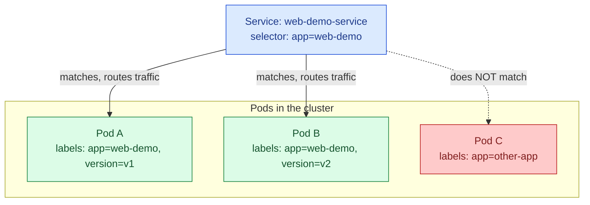

# Labels in Kubernetes

## What a Label Actually Is

A **label** is a small key-value pair attached to an object's metadata, and on its own it does almost nothing. A label doesn't configure behavior, doesn't affect how a Pod runs, and Kubernetes doesn't interpret the text of a label in any special way. What makes labels genuinely important is that almost every other piece of Kubernetes machinery — Services, Deployments, ReplicaSets, NetworkPolicies, and more — works by **selecting** a group of objects based on matching their labels, rather than by referring to those objects by name. Understanding labels really means understanding this selection mechanism, because that's where all of the actual behavior comes from.

This is a deliberately loose and dynamic way of grouping things, and it's worth sitting with why Kubernetes was designed this way instead of just letting a Deployment keep a fixed list of the exact Pod names it's responsible for. Pods in Kubernetes are constantly being created and destroyed — a Deployment replacing an unhealthy Pod, a rolling update swapping old Pods for new ones, the cluster autoscaler adding and removing capacity — and a fixed list of names would need to be rewritten constantly to stay accurate. A label selector doesn't have this problem: it just says "anything with this label, whenever it exists, belongs to this group," and Kubernetes continuously re-evaluates that membership rather than tracking it as a static list anywhere.



Notice in the diagram that Pod C isn't excluded by name or by any special configuration — it's simply excluded because its labels don't happen to match what the Service is looking for. This is the entire mechanism, in full: matching key-value pairs, nothing more exotic than that.

## Attaching Labels to an Object

Labels live under `metadata.labels` on essentially any Kubernetes object, and they're just a flat map of string keys to string values.

```yaml
apiVersion: v1
kind: Pod
metadata:
  name: web-demo
  labels:
    # There is nothing structurally special about any of these keys —
    # Kubernetes itself doesn't require or reserve "app", "tier", or
    # "version". They're conventions the community has settled on, not
    # rules the API server enforces.
    app: web-demo
    tier: backend
    version: v1
    environment: production
spec:
  containers:
    - name: web-demo
      image: web-demo:1.0
```

## How a Deployment Actually Uses Labels — the Part That Trips People Up

This is the single most important relationship to understand clearly, because a very common early mistake comes directly from misunderstanding it. A Deployment does not simply "create three Pods." What it actually does is manage a **ReplicaSet**, and that ReplicaSet's entire job is to continuously check the cluster for Pods matching a specific label selector, and to create or delete Pods as needed until the number matching that selector equals the desired replica count. The Pods it creates are stamped from a template, and that template's own labels are what make the Pods match the selector in the first place — but the selector and the template's labels are two separate fields that you write independently, and Kubernetes requires them to agree.

```yaml
apiVersion: apps/v1
kind: Deployment
metadata:
  name: web-demo
spec:
  replicas: 3
  selector:
    matchLabels:
      # This is the query the ReplicaSet controller runs continuously:
      # "how many Pods currently exist with the label app=web-demo?"
      # It is not a list of specific Pods — it's a live, ongoing filter.
      app: web-demo
  template:
    metadata:
      labels:
        # This is the label that gets stamped onto every Pod this
        # Deployment creates. It MUST include everything listed under
        # selector.matchLabels above, or Kubernetes will reject this
        # manifest outright with a validation error, because a
        # Deployment whose own Pods don't match its own selector would
        # immediately try to create endless new Pods to satisfy a
        # selector its existing Pods can never match.
        app: web-demo
    spec:
      containers:
        - name: web-demo
          image: web-demo:1.0
```

It's worth being explicit about why the validation error exists rather than just accepting the mismatch: if the selector and the template's labels didn't have to agree, you could end up with a Deployment that keeps creating Pods because its selector never finds any matches, while every Pod it creates is immediately invisible to that same selector — an infinite loop of Pod creation. Kubernetes prevents this entire class of bug by refusing to accept the manifest in the first place.

## How a Service Uses Labels

A Service works on exactly the same underlying mechanism, but for a different purpose: instead of counting Pods to decide how many to create, it uses the label selector to build a live list of Pod IP addresses to route network traffic to.

```yaml
apiVersion: v1
kind: Service
metadata:
  name: web-demo-service
spec:
  selector:
    # Any Pod anywhere in this namespace carrying the label app=web-demo
    # becomes a valid destination for traffic sent to this Service —
    # regardless of which Deployment, ReplicaSet, or bare Pod definition
    # happened to create it, and regardless of what else that Pod's
    # labels might say beyond this one match.
    app: web-demo
  ports:
    - port: 80
      targetPort: 8080
```

This has a genuinely useful practical consequence worth calling out directly: because the Service doesn't know or care which Deployment created a Pod, you can use this to gradually shift traffic between two different Deployments during something like a canary rollout, simply by having both Deployments' Pod templates carry the same `app: web-demo` label, even though they might differ in image version, resource limits, or anything else. The Service will happily route traffic to Pods from both Deployments at once, because from its perspective, a matching label is all that matters.

## Using Label Selectors from `kubectl`

The same selection logic that Services and Deployments use internally is available to you directly from the command line, and it's genuinely useful for narrowing down what you're looking at once a cluster has more than a handful of objects in it.

```bash
# Show only Pods carrying this exact label
kubectl get pods -l app=web-demo

# Combine multiple label requirements — this only matches Pods that
# have BOTH of these labels set to these exact values
kubectl get pods -l app=web-demo,environment=production

# Show Pods where a label exists at all, regardless of its value
kubectl get pods -l 'version'

# Show Pods where a label's value is one of several options
kubectl get pods -l 'version in (v1,v2)'

# Show Pods that do NOT have a particular label
kubectl get pods -l '!version'

# Show every label attached to each Pod in the output, rather than the
# default columns — useful for a quick visual audit of what's actually
# been applied
kubectl get pods --show-labels

# Add or change a label on an object that's already running, without
# editing and reapplying the whole manifest
kubectl label pod web-demo tier=backend

# Remove a label entirely by adding a dash directly after its key
kubectl label pod web-demo tier-
```

## Labels vs. Annotations — a Distinction Worth Getting Right

Kubernetes objects also support **annotations**, which look structurally identical to labels — they're both flat key-value maps under `metadata` — and this similarity is exactly what causes confusion about when to use which. The difference isn't about the data itself; it's about what Kubernetes' own selection machinery is allowed to do with it. Labels are specifically designed to be queried and matched against by selectors, and because of that, Kubernetes imposes some restrictions on label keys and values to keep them efficient to index and compare. Annotations carry no such restriction and can hold much larger, more free-form values, but in exchange, nothing in Kubernetes will ever select or filter objects based on an annotation's contents — they exist purely for attaching information for humans or external tooling to read, such as a build number, a description, or configuration for a specific controller that knows to look for that particular annotation key.

A reasonable rule of thumb: if you can imagine wanting to run `kubectl get pods -l <that-key>=<that-value>` to find a group of objects, it belongs in `labels`. If it's just descriptive metadata that nothing will ever need to filter on, it belongs in `annotations` instead.

## Recommended Labels Worth Adopting

Kubernetes doesn't require any specific label keys, but the project itself publishes a set of recommended, common label names specifically so that different tools (dashboards, monitoring systems, etc.) can rely on a shared vocabulary rather than every team inventing their own. Adopting these isn't mandatory, but it costs nothing and pays off the moment you introduce a second tool that expects them.

```yaml
metadata:
  labels:
    app.kubernetes.io/name: web-demo          # the application's name
    app.kubernetes.io/instance: web-demo-prod # a specific deployed instance of it
    app.kubernetes.io/version: "1.0"          # the application's version
    app.kubernetes.io/component: backend      # its role within the larger architecture
    app.kubernetes.io/part-of: web-platform   # the larger application it's one piece of
    app.kubernetes.io/managed-by: helm        # the tool that manages this object's lifecycle
```

## Mistakes Worth Watching For

The mistake described above — a Deployment's `selector` not matching its own `template.metadata.labels` — is common enough on its own to be worth repeating as a standalone warning, because the error message Kubernetes gives back can look intimidating the first time you see it, even though the underlying cause is almost always this exact mismatch.

A second, quieter mistake is a label selector that's broader than you intended, which doesn't produce any error at all, just unexpected behavior. If you reuse a label value like `app: web` across two genuinely different applications because it seemed convenient at the time, a Service or NetworkPolicy selecting on `app: web` will happily match Pods from both applications, sending traffic or granting network access somewhere you didn't intend. Because there's no error here — the selector is working exactly as written — this kind of mistake tends to surface much later, and only once someone notices traffic going somewhere unexpected.

A third mistake is changing a label on a Pod template after a Deployment already has Pods running under the old label. Since the Deployment identifies "its" Pods purely by label match, changing the template's labels doesn't relabel the existing Pods in place — instead, the existing Pods stop matching the (now-changed) selector requirements for new ones, and the Deployment will create entirely new Pods under the new labels, potentially leaving the old ones orphaned as Pods no controller is managing anymore, if the selector itself was also changed. This is part of why Kubernetes makes the `selector` field on a Deployment immutable after creation in most cases — to prevent exactly this kind of accidental orphaning.

## Checking What's Actually Selecting What

```bash
# Confirm exactly which labels a running Pod has
kubectl get pod web-demo --show-labels

# Confirm exactly which selector a Service is using, and cross-check it
# against the Pods you expect it to be routing to
kubectl describe service web-demo-service

# The most direct way to verify a Service actually found matching Pods:
# if this list is empty, the Service's selector isn't matching anything,
# and that's almost always a labels problem, not a networking problem
kubectl get endpoints web-demo-service
```