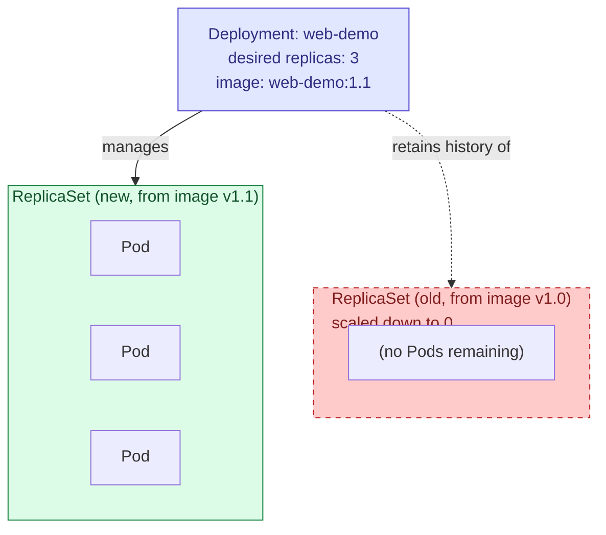

# Deployments in Kubernetes

## Why a Bare Pod Isn't Enough

Everything discussed in earlier notes about Pods assumed you were creating a Pod directly, and it's worth being blunt about why that's almost never what you actually want to do in a real system. A bare Pod, on its own, has no self-healing built into it at all. If the node it's running on crashes, or the container inside it exits and nobody is watching, that Pod is simply gone, permanently, and nothing in Kubernetes will notice or do anything about it. There's also no way to have more than one identical copy of it running for redundancy, and no structured way to roll out a new version of it without manually deleting the old Pod and creating a new one yourself, which would cause a period of complete downtime in between.

A **Deployment** exists to solve exactly these problems. You describe the Pod you want, how many copies of it should exist at once, and how you want changes to be rolled out over time, and the Deployment takes on the ongoing responsibility of making that description true in the cluster at all times, continuously, without you having to intervene.

## The Three-Layer Hierarchy: Deployment, ReplicaSet, Pod

This is the single most important structural thing to understand about how a Deployment actually works, because the object you create is not directly the thing managing your Pods — there's an intermediate layer in between that does the real day-to-day work.

When you create a Deployment, it doesn't create Pods itself. Instead, it creates a **ReplicaSet**, and it's that ReplicaSet whose actual job is to continuously check how many Pods currently exist matching a particular label selector, and create or delete Pods until that count matches the desired replica number. The Deployment's own responsibility, sitting one level above the ReplicaSet, is to manage the *transition* between different versions of that ReplicaSet over time — when you change the container image in a Deployment's Pod template, the Deployment doesn't modify the existing ReplicaSet's Pods in place; it creates an entirely new ReplicaSet with the new template, and then gradually shifts the replica counts between the old ReplicaSet and the new one until the old one reaches zero and the new one reaches the full desired count.



This is exactly why `kubectl rollout undo` is able to work instantly rather than needing to rebuild anything: the old ReplicaSet, along with its exact Pod template, is normally kept around (scaled down to zero Pods, but not deleted) precisely so that rolling back is just a matter of reversing which ReplicaSet is scaled up and which is scaled down. Understanding this hierarchy also explains why you'll sometimes see ReplicaSet objects when running `kubectl get replicasets` that you never created directly yourself — every one of them was created automatically by a Deployment, and normally you should never create or edit a ReplicaSet by hand, since the Deployment above it is the thing meant to own that responsibility.

## A Fully Commented Deployment

```yaml
apiVersion: apps/v1
kind: Deployment
metadata:
  name: web-demo
  labels:
    app: web-demo
spec:
  replicas: 3
  # This is the number of Pods the Deployment will continuously try to
  # keep running. If a Pod is deleted, crashes and can't recover, or its
  # node fails, the underlying ReplicaSet notices the count has dropped
  # below this number and creates a replacement automatically, without
  # you needing to intervene.

  selector:
    matchLabels:
      app: web-demo
    # This must match template.metadata.labels below, exactly. This is
    # the query the ReplicaSet runs to count "how many Pods belonging to
    # me currently exist" — if it doesn't match the Pods this same
    # Deployment creates, Kubernetes rejects the manifest outright.

  strategy:
    type: RollingUpdate
    # RollingUpdate replaces old Pods with new ones gradually, keeping
    # the application available throughout the update. The alternative,
    # "Recreate", terminates every existing Pod first and only then
    # creates the new ones — meaning guaranteed downtime during the
    # switch, but useful when your application genuinely cannot have
    # both old and new versions running at the same time, for example
    # if two versions can't safely share the same database schema.
    rollingUpdate:
      maxUnavailable: 1
      # During a rollout, at most this many Pods (relative to the
      # desired replica count) are allowed to be unavailable at once.
      # With replicas: 3 and maxUnavailable: 1, the Deployment will
      # never let more than one Pod be down for the update at any
      # given moment, keeping at least 2 of the 3 serving traffic.
      maxSurge: 1
      # During a rollout, at most this many EXTRA Pods beyond the
      # desired replica count are allowed to exist temporarily. With
      # replicas: 3 and maxSurge: 1, the Deployment is allowed to
      # briefly run up to 4 Pods at once while transitioning, giving
      # the new version time to become ready before an old one is
      # removed.

  template:
    # Everything from here down is a full Pod specification, nested
    # inside the Deployment. This exact block is what gets stamped out
    # multiple times to create the actual Pods, and it's also the part
    # that changes whenever you deploy a new version — a new image tag
    # here is what triggers the whole rolling update process described
    # above.
    metadata:
      labels:
        app: web-demo
        # Every Pod this Deployment creates gets this label, which is
        # what makes it match the selector above.
    spec:
      containers:
        - name: web-demo
          image: web-demo:1.1
          # Bumping this tag and re-applying the manifest is the single
          # most common Deployment operation there is — it's what
          # triggers the rolling update mechanism described above.
          ports:
            - containerPort: 8080
          readinessProbe:
            httpGet:
              path: /ready
              port: 8080
            periodSeconds: 5
            # The readiness probe matters enormously during a rolling
            # update specifically: a newly created Pod is not counted
            # as "available" by the rollout process until it passes
            # this check, which is what actually paces the whole
            # rollout and prevents Kubernetes from routing traffic to
            # a new Pod before it's actually ready to serve it.
          resources:
            requests:
              cpu: "100m"
              memory: "128Mi"
            limits:
              cpu: "250m"
              memory: "256Mi"
```

## Watching and Controlling a Rollout

```bash
# Apply a change (for example, after editing the image tag above)
kubectl apply -f web-demo-deployment.yaml

# Watch the rollout happen in real time — this blocks until the
# rollout finishes, fails, or you interrupt it
kubectl rollout status deployment/web-demo

# A faster way to change just the image without editing the YAML file
# directly — genuinely common as part of a CI/CD pipeline step
kubectl set image deployment/web-demo web-demo=web-demo:1.2

# See the history of rollouts this Deployment has been through
kubectl rollout history deployment/web-demo

# Roll back to the immediately previous version — this works instantly
# because, as explained above, the old ReplicaSet and its Pod template
# were kept around rather than deleted
kubectl rollout undo deployment/web-demo

# Roll back to a specific numbered revision, rather than just "the
# previous one" — useful if the last two rollouts were both bad and you
# need to go back further than one step
kubectl rollout undo deployment/web-demo --to-revision=3

# Temporarily halt a rollout partway through, for example if you notice
# something looking wrong and want to stop before it reaches every Pod
kubectl rollout pause deployment/web-demo

# Resume a paused rollout
kubectl rollout resume deployment/web-demo
```

## Scaling

```bash
# Change the replica count directly, without touching the image or
# anything else about the Pod template
kubectl scale deployment/web-demo --replicas=5
```

It's worth noting explicitly that scaling and rolling out a new version are two independent operations that happen to use the same underlying mechanism. Changing `replicas` doesn't create a new ReplicaSet the way changing the image does — it just adjusts how many Pods the *current* ReplicaSet is responsible for keeping alive. Only a change to the Pod template itself (the image, environment variables, resource limits, or anything else nested under `spec.template`) triggers the creation of a brand new ReplicaSet and the rolling-update process between old and new.

## Self-Healing in Practice

The reason a Deployment gives you resilience that a bare Pod never could comes entirely from the continuous reconciliation performed by the ReplicaSet underneath it, and it's worth walking through concretely what that actually looks like when something goes wrong.

If a single Pod out of the three managed by a Deployment crashes and the container can't recover on its own, the ReplicaSet's ongoing count of matching Pods drops from three to two. On its very next reconciliation pass — which happens continuously, not on some fixed schedule you configure — it notices the count no longer matches the desired replica count of three, and it creates a new Pod from the exact same template to bring the count back up. This new Pod is not "the same Pod restarted" in any sense; it's a completely new object, with a new name and a new internal IP address, scheduled onto whichever node currently has room for it, which might not even be the same node the failed Pod was running on. This is exactly why nothing in a well-designed system should ever hard-code a specific Pod's name or IP address anywhere — a Service, using label selection as described in the notes on labels, is what's meant to provide a stable way to reach "whichever Pods currently exist for this application," specifically because individual Pods are expected to come and go.

## Mistakes Worth Watching For

A very common point of confusion is expecting `kubectl edit deployment` or a change to `spec.replicas` alone to trigger a rolling update the way an image change does. It won't — as explained above, only a change to the Pod template itself starts that process, so simply scaling up or down doesn't roll anything out; it just adds or removes Pods from the currently active ReplicaSet.

Another mistake is setting `maxUnavailable` and `maxSurge` to values that don't actually fit the situation. With a very small replica count — say, `replicas: 2` — leaving `maxUnavailable` at its default can mean a rollout is allowed to take down a full 50% of your capacity at once, which might be more disruption than you intended for a small deployment. Reviewing these two values in light of your actual replica count, rather than leaving the defaults unexamined, is worth doing before you rely on this in production.

A third mistake is not setting a `readinessProbe` at all on a Deployment's Pod template. Without one, Kubernetes considers a container "ready" the instant its process starts, which during a rolling update means traffic can be routed to a brand new Pod before the application inside it has actually finished initializing — causing a burst of failed requests during every single deployment, precisely at the moment you're trying to update safely.

## Checking the Current State

```bash
# High-level view: desired vs. current vs. up-to-date vs. available
# replica counts, all in one line
kubectl get deployment web-demo

# Full detail, including recent events and which ReplicaSet is
# currently active
kubectl describe deployment web-demo

# See the ReplicaSets a Deployment has created over time — normally
# you'll see the currently active one with Pods, and one or more older
# ones scaled down to zero, kept around for rollback purposes
kubectl get replicasets -l app=web-demo
```