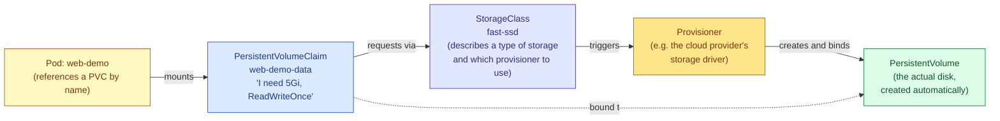

# Persistent Storage in Kubernetes

## Why This Is a Separate Topic from Volumes in General

An earlier note covered volumes broadly, including the `emptyDir` type for temporary scratch space and the `configMap` type for delivering configuration as files. This note focuses specifically on the part of that picture meant to solve real, lasting persistence — data that must survive a Pod being deleted and a replacement Pod being created somewhere else in the cluster, potentially on an entirely different physical machine. Getting this right involves three distinct objects working together: the **PersistentVolume**, the **PersistentVolumeClaim**, and the **StorageClass**. Each one plays a genuinely different role, and a lot of the confusion people run into with Kubernetes storage comes from not clearly separating what each of the three is actually responsible for.

## The Three Objects and the Relationship Between Them

A **PersistentVolume**, usually abbreviated PV, represents an actual, concrete piece of storage that has been made available to the cluster — a real disk somewhere, whether that's a cloud provider's block storage service, a network filesystem, or a directory on a specific node. A PV exists independently of any particular Pod or even any particular namespace; it's a cluster-level resource that simply says "this storage exists and can be used."

A **PersistentVolumeClaim**, usually abbreviated PVC, is a *request* for storage, made by a user or by an application's manifest, specifying how much storage is needed and what access pattern it requires, without needing to know or care exactly which physical disk will end up fulfilling that request. This separation is deliberate: the person writing a Pod's manifest generally shouldn't need to know the underlying storage infrastructure's details, and the underlying infrastructure shouldn't need to be described differently for every single application that wants to use it.

A **StorageClass** is what connects the two together automatically, and its existence is why you almost never have to manually create a PersistentVolume yourself in a modern cluster. A StorageClass describes a "type" of storage available in this cluster — for example, "fast SSD-backed block storage" — along with which underlying provisioner should be used to actually create a new disk on demand when someone asks for it. When a PVC requests storage and specifies a StorageClass, the StorageClass's provisioner automatically creates a brand new PersistentVolume that satisfies the request, with no human needing to have created that PV in advance. This entire automatic process is called **dynamic provisioning**, and it's how the overwhelming majority of persistent storage actually gets created in real clusters today.



The Pod itself never talks to a PersistentVolume or a StorageClass directly — it only ever references a PersistentVolumeClaim by name, which is precisely what keeps the Pod's manifest simple and portable across different clusters that might have entirely different underlying storage infrastructure behind the scenes.

## Requesting Storage with a PersistentVolumeClaim

```yaml
apiVersion: v1
kind: PersistentVolumeClaim
metadata:
  name: web-demo-data
spec:
  accessModes:
    # ReadWriteOnce means the resulting volume can be mounted as
    # read-write by Pods on a SINGLE node at a time. This is the
    # normal, safe default for something like a single-instance
    # database, where you specifically do not want two different
    # Pods on two different nodes both writing to the same disk
    # simultaneously, which could corrupt the data.
    - ReadWriteOnce
  storageClassName: fast-ssd
  # This names the StorageClass that should fulfill this request. If
  # you leave this field out entirely, Kubernetes uses whichever
  # StorageClass has been marked as the cluster's default, if one
  # exists — which is a detail worth being aware of, since an omitted
  # storageClassName does not mean "no storage class," it means
  # "whatever the administrator configured as the default."
  resources:
    requests:
      storage: 5Gi
      # The minimum amount of storage being requested. The actual
      # disk created will be at least this large, though the exact
      # behavior around exceeding this size depends on the specific
      # storage provisioner being used.
```

## The Access Modes, Explained Properly

The access mode on a PVC is not a minor detail — it fundamentally shapes what kind of application the resulting storage is actually suitable for, and getting it wrong is a common source of confusing scheduling failures.

**ReadWriteOnce** allows the volume to be mounted read-write, but only by Pods running on a single node at any given time. Depending on the specific version of Kubernetes and the storage driver involved, this restriction has historically been enforced at the level of "one node," meaning multiple Pods on the *same* node could technically all mount it, though relying on that behavior is fragile and this is generally treated as a single-writer volume in practice. This is far and away the most common access mode, appropriate for the overwhelming majority of stateful applications — a single database instance, a single application instance writing its own data.

**ReadOnlyMany** allows the volume to be mounted by many Pods across many different nodes simultaneously, but strictly read-only. This suits a situation where some dataset is prepared once and then needs to be read by many replicas of an application at the same time — a shared reference dataset, for example — but none of them ever need to modify it.

**ReadWriteMany** allows the volume to be mounted read-write by many Pods across many different nodes simultaneously. This is the access mode that lets multiple replicas of an application genuinely share and concurrently write to the same storage, which sounds like it should be the obvious general-purpose choice, but it comes with an important caveat: not every storage backend supports it. Many of the most common cloud block storage services, including AWS EBS and GCP Persistent Disk, fundamentally do not support ReadWriteMany, because they're built around the assumption of a single attached node. Achieving ReadWriteMany generally requires a network filesystem specifically designed for concurrent multi-node access, such as NFS, and requesting ReadWriteMany against a StorageClass backed by something that can't provide it will simply leave the PVC stuck, unable to bind to anything.

## What Happens to the Data When You Delete the Claim

A field on the underlying PersistentVolume, usually set automatically based on the StorageClass that created it, controls what happens to the actual disk once the PersistentVolumeClaim that was using it is deleted. This matters enough to be worth understanding explicitly rather than discovering by accident.

A **reclaim policy** of `Delete` means that when the PVC is deleted, the underlying PersistentVolume and the real disk behind it are also deleted automatically, permanently, with the data gone for good. This is the default reclaim policy for most dynamically provisioned storage in cloud environments, and it's worth genuinely sitting with the implication: deleting a PVC by mistake, for example while cleaning up what you thought was an unrelated set of resources, can permanently destroy a database's actual data with no confirmation prompt of any kind.

A reclaim policy of `Retain` means that when the PVC is deleted, the underlying PersistentVolume and its data are left alone entirely. The PersistentVolume object itself moves into a "Released" state, and someone has to manually intervene to either clean it up or make it usable again for a future claim, but the actual data on disk is never automatically destroyed. For anything genuinely critical, changing the reclaim policy to `Retain`, or otherwise ensuring proper backups exist independently of the PVC's lifecycle, is a deliberate decision worth making rather than leaving to whatever a StorageClass happened to default to.

> Check the reclaim policy currently set on a specific PersistentVolume
```bash
kubectl get pv <pv-name> -o jsonpath='{.spec.persistentVolumeReclaimPolicy}'
```

## Mounting the Claim into a Pod

Once a PersistentVolumeClaim exists, using it from a Pod looks exactly the same as any other volume mount, because from the Pod's perspective, a PVC is just another kind of volume source.

```yaml
apiVersion: v1
kind: Pod
metadata:
  name: web-demo
spec:
  containers:
    - name: web-demo
      image: web-demo:1.0
      volumeMounts:
        - name: data-volume
          mountPath: /app/data
          # Anything written here goes to the actual disk behind the
          # bound PersistentVolume. If this Pod is deleted and a
          # replacement Pod mounts the same claim, it will see
          # everything that was written here previously.
  volumes:
    - name: data-volume
      persistentVolumeClaim:
        claimName: web-demo-data
```

## Why StatefulSets Exist Alongside This

A single Pod referencing a single PVC, as shown above, works fine for an application that only ever needs one instance with persistent storage. Things get more complicated the moment you want *several* replicas of something stateful, each needing its own separate, dedicated storage rather than all of them sharing one disk — several database replicas each needing their own data directory, for example.

A **Deployment** is a poor fit for this situation, because every Pod a Deployment creates comes from an identical template, and a fixed `claimName` in that template would mean every single replica tries to mount the exact same PVC, which conflicts directly with the ReadWriteOnce access mode's single-node restriction the moment you have more than one replica. A **StatefulSet** solves this specific problem by giving each replica its own stable, numbered identity, and by automatically creating a separate, individually-provisioned PersistentVolumeClaim for each replica, so that the first replica gets its own dedicated volume, the second replica gets a different dedicated volume, and so on — this is genuinely the primary reason StatefulSets exist as a distinct object from Deployments, rather than being purely about naming or ordering.

## Checking the State of Things


> See all PersistentVolumeClaims and whether they've successfully
> bound to a PersistentVolume yet
```bash
kubectl get pvc
```
> See the actual PersistentVolumes in the cluster, including which
> claim (if any) each one is currently bound to
```bash
kubectl get pv
```
> Full detail on a specific claim — useful when a PVC is stuck in a
> "Pending" state and never binds, since the events shown here usually
> explain exactly why (for example, no StorageClass could satisfy the
> requested access mode)
```bash
kubectl describe pvc web-demo-data
```
> List the StorageClasses available in this cluster, and see which one
> (if any) is marked as the default
```bash
kubectl get storageclass
```

## Mistakes Worth Watching For

A PVC stuck permanently in `Pending` almost always traces back to one of a small number of causes: requesting an access mode the underlying StorageClass genuinely cannot provide (ReadWriteMany against a block-storage-only provisioner is the classic case), naming a `storageClassName` that doesn't actually exist in this cluster, or, in a cluster with no default StorageClass configured at all, simply omitting `storageClassName` and expecting dynamic provisioning to happen anyway when nothing is actually set up to do it automatically.

Another mistake is assuming that resizing a PVC's requested storage after the fact is always as simple as editing the YAML and reapplying it. Whether a PVC can be expanded after creation depends on whether the StorageClass that provisioned it explicitly allows volume expansion, and even when it does, some storage backends require the Pod using the volume to be restarted before the larger size is actually usable by the filesystem inside the container.

A third, quieter mistake is not thinking about the reclaim policy until after something important has already been deleted. Checking what reclaim policy a critical PVC's underlying PersistentVolume actually has, before you need it, costs almost nothing and can be the difference between an inconvenience and a genuine data-loss incident.
