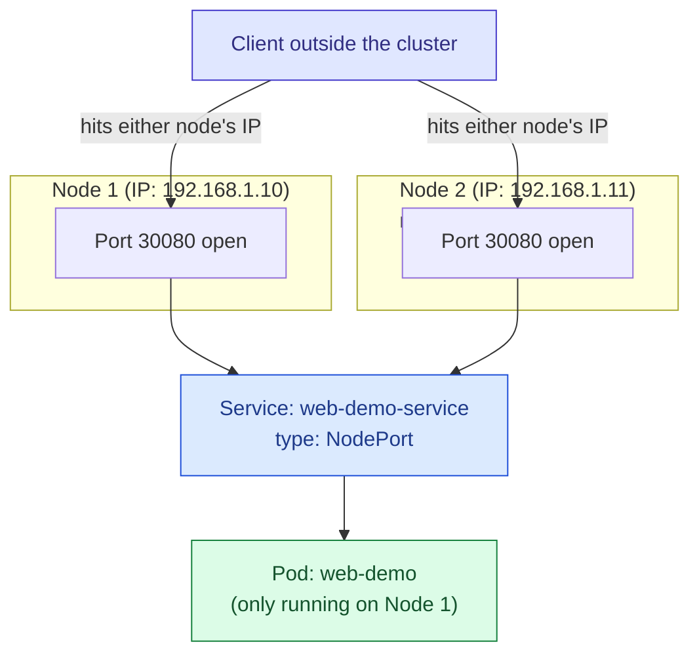

## `NodePort`

### What it actually does

A `NodePort` Service does everything a `ClusterIP` Service does, and additionally opens one specific port on the network interface of **every single node** in the cluster — not just whichever node happens to be running a matching Pod. Traffic arriving at that port, on any node's own IP address, gets picked up and forwarded through to the Service, which then routes it to one of the matching Pods exactly as a `ClusterIP` Service would internally.



This diagram highlights the part that surprises people the first time: you can send traffic to **any** node's IP address on that port, even a node that isn't currently running a single matching Pod, and it will still reach the application correctly, because the Service layer underneath handles the actual routing regardless of which node the traffic initially arrived at.

### Example

```yaml
apiVersion: v1
kind: Service
metadata:
  name: web-demo-service
spec:
  type: NodePort
  selector:
    app: web-demo
  ports:
    - port: 80
      targetPort: 8080
      nodePort: 30080
      # Restricted to a specific range, typically 30000-32767 by
      # default. If omitted, Kubernetes assigns an available port in
      # that range automatically rather than requiring you to pick one.
```

### When to use it

In practice, this type is used far more often as a low-level building block than as something you'd choose directly for a production application. Its most genuinely common real-world use is in local development clusters — tools like kind or minikube — where there is no cloud provider available to fulfill a `LoadBalancer` request, making `NodePort` the most practical way to reach something from outside the cluster during testing. It's a fairly blunt mechanism: you're responsible for knowing a node's actual IP address, the port number is awkward and outside the normal range people expect for web traffic, and it doesn't handle multiple nodes failing over gracefully on its own the way a real external load balancer would.

---

