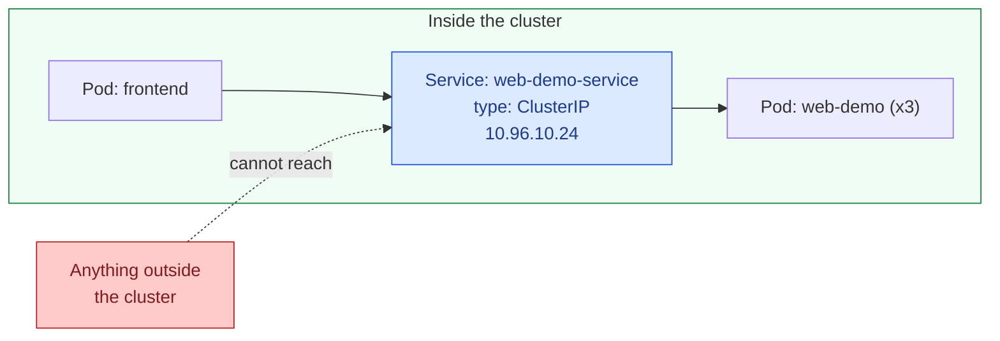

## `ClusterIP`

### What it actually does

A `ClusterIP` Service is assigned a single, stable virtual IP address that exists only within the cluster's own internal network. Nothing outside the cluster can route to this address at all, regardless of firewall rules or network configuration elsewhere, because it isn't a real address on any physical or cloud network — it only has meaning to `kube-proxy` running on the cluster's own nodes. Any Pod inside the cluster, in any namespace, can reach it, whether by its DNS name or its virtual IP directly.



### Example

```yaml
apiVersion: v1
kind: Service
metadata:
  name: web-demo-service
spec:
  type: ClusterIP
  # This line can actually be omitted entirely — ClusterIP is the
  # default type applied automatically if "type" is left unset. It's
  # written explicitly here purely for clarity.
  selector:
    app: web-demo
  ports:
    - port: 80          # what other Pods use to reach this Service
      targetPort: 8080   # what the container itself is listening on
```

### When to use it

This is the correct default for the large majority of Services inside a typical application — anything that only ever needs to be reached by other things running in the same cluster. A backend API that's only ever called by a frontend Pod also running in the cluster, a database, an internal cache, an internal metrics endpoint — all of these should almost always be `ClusterIP`, precisely because there is no legitimate reason for anything outside the cluster to reach them directly, and giving them any broader exposure than that would be an unnecessary security surface for no benefit.

---
