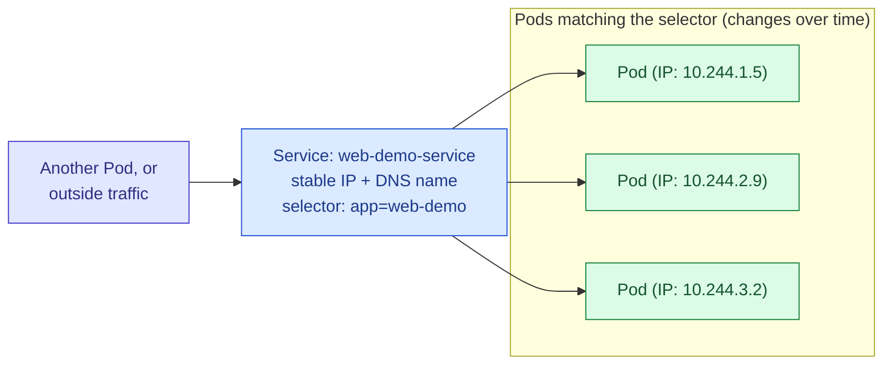

# Services in Kubernetes

## The Problem a Service Solves

Earlier notes on Deployments and labels already touched on this, but it's worth stating plainly as its own starting point: Pods are not stable things to talk to directly. A Pod gets a new internal IP address every single time it's created, and as covered in the Deployment notes, Pods are routinely destroyed and replaced — by a failed health check, a rolling update, a node failure, or simply scaling up and down. If one part of your application tried to remember and connect directly to a specific Pod's IP address, that connection would break the very next time Kubernetes replaced that Pod, which could happen at almost any moment for reasons entirely outside your control.

A **Service** exists to give you something stable to connect to instead, sitting in front of a constantly-changing set of Pods. It has its own stable IP address and DNS name that never change for as long as the Service exists, and behind the scenes it continuously tracks which Pods currently match its label selector, forwarding traffic to whichever ones are currently healthy and ready, without whoever is connecting to the Service ever needing to know or care how many Pods exist or which ones they are at any given moment.



## How a Service Actually Finds Its Pods: Endpoints

A Service's connection to real Pods happens through the exact same label-selector mechanism described in the notes on labels, and it's worth being precise about the intermediate object involved, because it's genuinely useful for debugging. When you create a Service with a `selector`, Kubernetes continuously maintains a separate object called an **Endpoints** object (or, in newer versions, an `EndpointSlice`) that holds the actual current list of IP addresses and ports for every Pod currently matching that selector and passing its readiness probe. The Service itself doesn't route traffic based on re-evaluating the selector on every single request — it relies on this continuously updated list. This is exactly why, when a Service seems to not be working, checking whether it actually has any endpoints at all is normally the very first and most informative diagnostic step, because an empty endpoints list means the selector isn't matching anything, which is a labels problem, not a networking problem.

```bash
# If this list is empty, the Service's selector isn't matching any
# currently-ready Pods — almost always a mismatched or missing label,
# not an issue with the Service definition itself
kubectl get endpoints web-demo-service
```

## The Four Service Types, Explained by What Problem Each One Solves

Kubernetes doesn't offer several Service types out of arbitrary variety — each type answers a genuinely different question about who needs to reach this Service and from where.

### `ClusterIP` — the default, for internal-only communication

```yaml
apiVersion: v1
kind: Service
metadata:
  name: web-demo-service
spec:
  type: ClusterIP
  # This is the default type, used automatically if "type" is left out
  # entirely. It creates a stable, virtual IP address that only exists
  # WITHIN the cluster's own internal network — nothing outside the
  # cluster can reach it directly, no matter how the network is
  # otherwise configured. This is the right choice for the large
  # majority of Services in a typical application, such as a backend
  # API that only ever needs to be reached by other services running
  # in the same cluster, never directly by the outside world.
  selector:
    app: web-demo
  ports:
    - port: 80
      # The port other things inside the cluster use to reach this
      # Service, at its stable internal IP or DNS name.
      targetPort: 8080
      # The port the actual container is listening on. These don't
      # have to match — this Service could be reached on port 80
      # externally-within-the-cluster while the container itself only
      # knows about port 8080, letting you present a conventional
      # port to consumers regardless of what the app itself uses.
```

### `NodePort` — reachable from outside, through any node's own IP

```yaml
apiVersion: v1
kind: Service
metadata:
  name: web-demo-service
spec:
  type: NodePort
  # In addition to everything a ClusterIP Service provides, this opens
  # a specific port on EVERY node in the cluster, such that traffic
  # arriving at that port on any node's own IP address — not just the
  # node actually running a matching Pod — gets forwarded through to
  # this Service. This is a fairly blunt way to expose something
  # externally: it's not commonly used directly in production behind
  # a proper cloud load balancer, but it's genuinely useful for local
  # development clusters (such as kind or minikube) where a cloud
  # LoadBalancer type isn't available at all.
  selector:
    app: web-demo
  ports:
    - port: 80
      targetPort: 8080
      nodePort: 30080
      # Must fall within a specific, fairly high range (typically
      # 30000-32767 by default) reserved by Kubernetes for exactly
      # this purpose. If you leave this out, Kubernetes picks an
      # available port in that range for you automatically.
```

### `LoadBalancer` — the standard way to expose something to the public internet

```yaml
apiVersion: v1
kind: Service
metadata:
  name: web-demo-service
spec:
  type: LoadBalancer
  # This builds on top of everything a NodePort Service does, and
  # additionally asks the cloud provider the cluster is running on
  # (AWS, GCP, Azure, and so on) to provision an actual, real external
  # load balancer using that provider's own infrastructure, and to
  # point it at this Service. This is genuinely the standard way to
  # expose a service directly to the public internet in a cloud
  # environment, and it requires the cluster to be running somewhere
  # with a cloud provider integration capable of fulfilling this
  # request — a bare local cluster with no such integration will
  # simply leave this Service's external IP stuck showing
  # "<pending>" forever, since nothing is watching to fulfill it.
  selector:
    app: web-demo
  ports:
    - port: 80
      targetPort: 8080
```

### `ExternalName` — a DNS alias to something outside the cluster entirely

```yaml
apiVersion: v1
kind: Service
metadata:
  name: legacy-database
spec:
  type: ExternalName
  # This is structurally different from the other three types in an
  # important way: it doesn't route traffic to any Pods at all, and
  # it has no selector, because there's nothing inside the cluster
  # for it to point to. Instead, it makes this Service's DNS name
  # resolve, from inside the cluster, directly to the external
  # hostname given here. This is useful when an application inside
  # the cluster needs to talk to something that lives outside of
  # Kubernetes entirely, such as a managed database service, while
  # letting the rest of your manifests refer to it the same
  # consistent way they'd refer to any other internal Service.
  externalName: legacy-db.example.com
```

## How DNS Resolution Actually Works for a Service

Every Service, of any type except `ExternalName`, automatically gets a predictable DNS name inside the cluster, created and managed by the cluster's internal DNS system (almost always CoreDNS in a modern cluster), without you needing to configure anything extra yourself.

```
<service-name>.<namespace>.svc.cluster.local
```

From inside the same namespace as the Service, the short form `web-demo-service` alone is enough to resolve correctly, because the cluster's DNS configuration automatically appends the current namespace and the rest of the suffix during lookup. From a different namespace, you need at least `web-demo-service.<namespace>`, and the fully qualified form shown above always works from anywhere in the cluster, regardless of which namespace you're calling from. This is genuinely the mechanism most applications should rely on to find each other — hard-coding an IP address anywhere is fragile in exactly the way described earlier, while a Service's DNS name is stable for as long as the Service itself exists, completely independent of the Pods currently behind it.

## What Actually Forwards the Traffic: `kube-proxy`

It's worth being clear that a `ClusterIP` isn't a real network interface sitting somewhere waiting for connections in the way a normal server's IP address is. The forwarding of traffic sent to a Service's virtual IP toward one of its actual backing Pods is carried out by **kube-proxy**, a component that runs on every node in the cluster, watching the Endpoints object described earlier and continuously updating the node's own networking rules (commonly implemented using iptables or IPVS under the hood) so that traffic destined for a Service's IP gets transparently rewritten to go to one of the currently-healthy backing Pods instead. This is also the mechanism responsible for basic load balancing across multiple Pods behind the same Service — by default, kube-proxy distributes connections roughly evenly across whichever Pods currently appear in the Endpoints list, with no additional configuration required for that baseline behavior.

## Headless Services: When You Want the Pod IPs Directly

Sometimes an application specifically needs to know about each individual Pod behind a Service, rather than having traffic transparently load-balanced across them — this comes up commonly with StatefulSets, where each replica has its own distinct identity and other parts of the system may need to address a specific replica directly rather than "any one of them."

```yaml
apiVersion: v1
kind: Service
metadata:
  name: web-demo-headless
spec:
  clusterIP: None
  # Setting this explicitly to "None" is what makes a Service
  # "headless." Instead of getting a single virtual IP that
  # transparently load-balances across Pods, a DNS lookup against
  # this Service's name returns the individual IP addresses of EVERY
  # currently-matching Pod directly, letting the calling application
  # choose which one to connect to itself, or connect to all of them.
  selector:
    app: web-demo
  ports:
    - port: 80
      targetPort: 8080
```

## Mistakes Worth Watching For

The single most common Service problem, by a wide margin, is a selector that doesn't match any currently-ready Pods, which — exactly as covered in the notes on labels — produces no error message anywhere. The Service object is created successfully either way; it simply has nothing behind it. Checking `kubectl get endpoints` for the Service, as shown earlier, is the fastest way to confirm whether this is what's happening before investigating anything more complicated.

A second mistake is confusing `port` and `targetPort` inside a Service's ports definition, which are genuinely two different numbers describing two different things: `port` is what other things use to reach the Service itself, while `targetPort` is what the container is actually listening on internally. Setting them to the same value works perfectly well and is extremely common, but they don't have to match, and assuming they always do can lead to confusion when someone else's manifest deliberately uses different values for each.

A third mistake is choosing `LoadBalancer` for a Service in an environment that has no cloud provider integration capable of fulfilling that request — most commonly a local development cluster. The Service will simply sit with its external address perpetually shown as `<pending>`, which looks like a stuck or failing process but is actually just Kubernetes correctly waiting for something that will never arrive. In that situation, `NodePort` or simply port-forwarding with `kubectl port-forward` for local testing is the more appropriate choice.

## Checking the Current State

```bash
# List Services and their type, cluster IP, and any external IP
kubectl get services

# Full detail, including the selector being used and the ports
# configured — useful for confirming exactly what a Service is
# actually configured to do
kubectl describe service web-demo-service

# Confirm which Pods a Service has actually found and considers
# healthy right now
kubectl get endpoints web-demo-service

# Test connectivity to a Service from inside the cluster's own
# network, exactly as another Pod would experience it
kubectl run tmp-shell --rm -it --image=busybox -- wget -qO- http://web-demo-service
```

## Choosing Between Them: A Straightforward Way to Decide

Ask, in order: does this need to be reached by something outside the cluster at all? If no, use `ClusterIP` and stop there — this covers most Services in any real application. If yes, is this running in an environment with a real cloud load balancer integration available? If yes, use `LoadBalancer`. If no — most commonly because you're working in a local development cluster — use `NodePort` instead, purely as a practical stand-in until you're running somewhere a `LoadBalancer` can actually be provisioned. Separately from all of that: is the thing you're trying to reach not actually running inside this cluster at all? If so, none of the first three apply, and `ExternalName` is the type that actually fits the situation.

## Quick Reference

| Type | Reachable from | Needs cloud integration? | Typical use |
|---|---|---|---|
| `ClusterIP` | Inside the cluster only | No | Default choice — internal APIs, databases, caches |
| `NodePort` | Any node's IP, from outside too | No | Local development clusters, low-level building block |
| `LoadBalancer` | The public internet, via a real external address | Yes | Public-facing entry points in a cloud environment |
| `ExternalName` | N/A — it's a DNS alias, not a traffic route | No | Referring to something outside the cluster by an internal name |