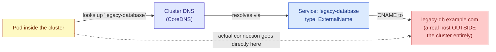

## `ExternalName`

### What it actually does

This type is structurally unlike the other three, and it's worth being clear about why. It creates **no** virtual IP, opens **no** port anywhere, and has **no** selector, because it isn't routing traffic to any Pods at all. Instead, it configures the cluster's internal DNS so that a lookup of this Service's name returns a `CNAME` record pointing at an external hostname you specify — meaning it's purely a DNS-level alias, resolved before any actual network connection is even attempted.



### Example

```yaml
apiVersion: v1
kind: Service
metadata:
  name: legacy-database
spec:
  type: ExternalName
  externalName: legacy-db.example.com
  # No selector and no ports are defined here, because this Service
  # never actually handles any traffic itself — it only ever answers
  # a DNS question, pointing the caller onward to connect directly to
  # the real external host instead.
```

### When to use it

This is useful specifically when something inside the cluster needs to talk to a resource that lives outside Kubernetes entirely — a managed database service, a legacy system that hasn't been migrated into the cluster, a third-party API your team wants to reference through an internal, consistent name rather than hard-coding an external hostname throughout your application code. It lets every other manifest refer to `legacy-database` the same way it would refer to any other internal Service, and if the real external hostname ever changes, updating this one Service definition is the only change needed, rather than hunting down every place the old hostname was hard-coded.

---