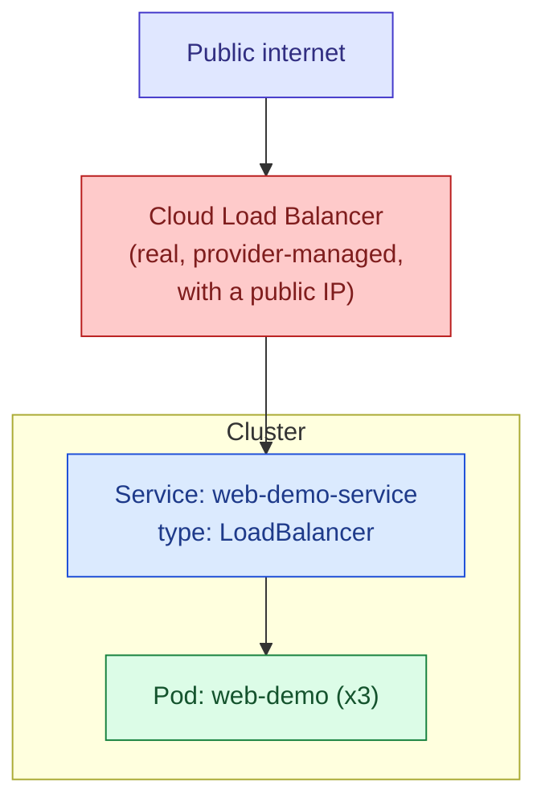

## `LoadBalancer`

### What it actually does

A `LoadBalancer` Service builds on top of everything a `NodePort` Service provides, and additionally asks the cloud platform the cluster is running on to provision a genuine, real external load balancer using that provider's own infrastructure — an actual AWS Elastic Load Balancer, a Google Cloud Load Balancer, or the equivalent on whichever provider is in use — and to configure it to forward traffic to the NodePort opened on the cluster's nodes underneath. This requires the cluster to be running with a specific integration (a "cloud controller manager") capable of actually talking to that cloud provider's API to create the load balancer on your behalf.



### Example

```yaml
apiVersion: v1
kind: Service
metadata:
  name: web-demo-service
spec:
  type: LoadBalancer
  selector:
    app: web-demo
  ports:
    - port: 80
      targetPort: 8080
```

```bash
# After applying this, the EXTERNAL-IP column will initially show
# <pending> while the cloud provider provisions the actual load
# balancer — this can take anywhere from a few seconds to a couple of
# minutes, and is normal, not an error
kubectl get service web-demo-service
```

### When to use it

This is the standard way to expose something directly to the public internet when running in a cloud environment with the appropriate integration available. It's what you'd use for the actual public-facing entry point of an application — though in practice, on a cluster running many different applications, it's far more common to have just one or a small number of `LoadBalancer` Services acting as a shared entry point (often fronting an Ingress controller), rather than giving every individual application its own separate cloud load balancer, since each one typically has its own ongoing cost from the cloud provider.

### The one thing that catches people out

Requesting `type: LoadBalancer` on a cluster with no cloud integration — a bare local cluster, or certain self-managed setups without one configured — will simply leave the Service's external address stuck on `<pending>` indefinitely. This isn't a bug or a stuck process; it's Kubernetes correctly waiting for a piece of infrastructure that nothing in that environment is actually able to provide. In that situation, `NodePort` or `kubectl port-forward` are the realistic alternatives for reaching something from outside the cluster.

---

