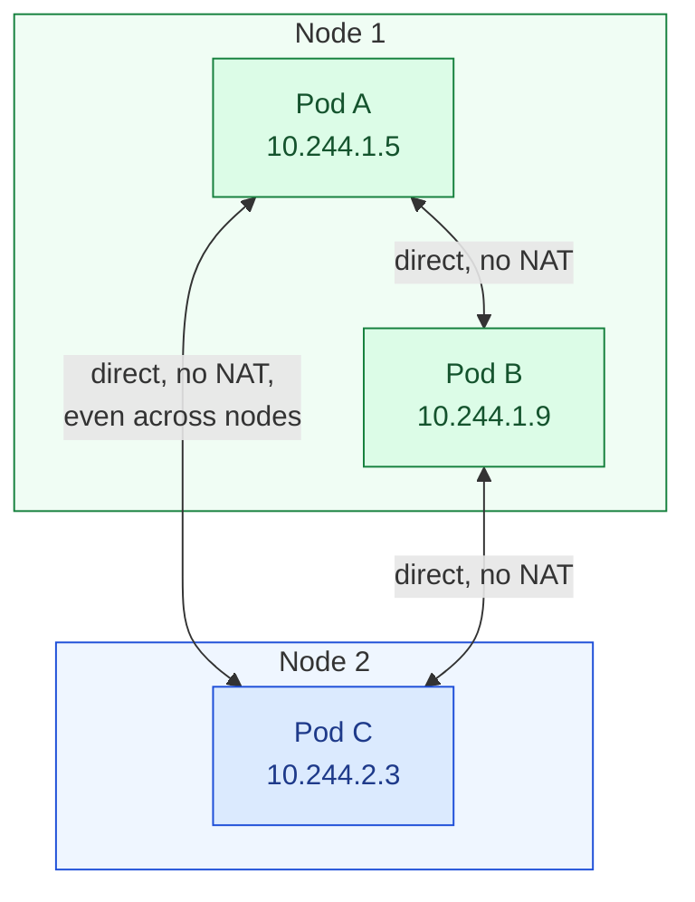
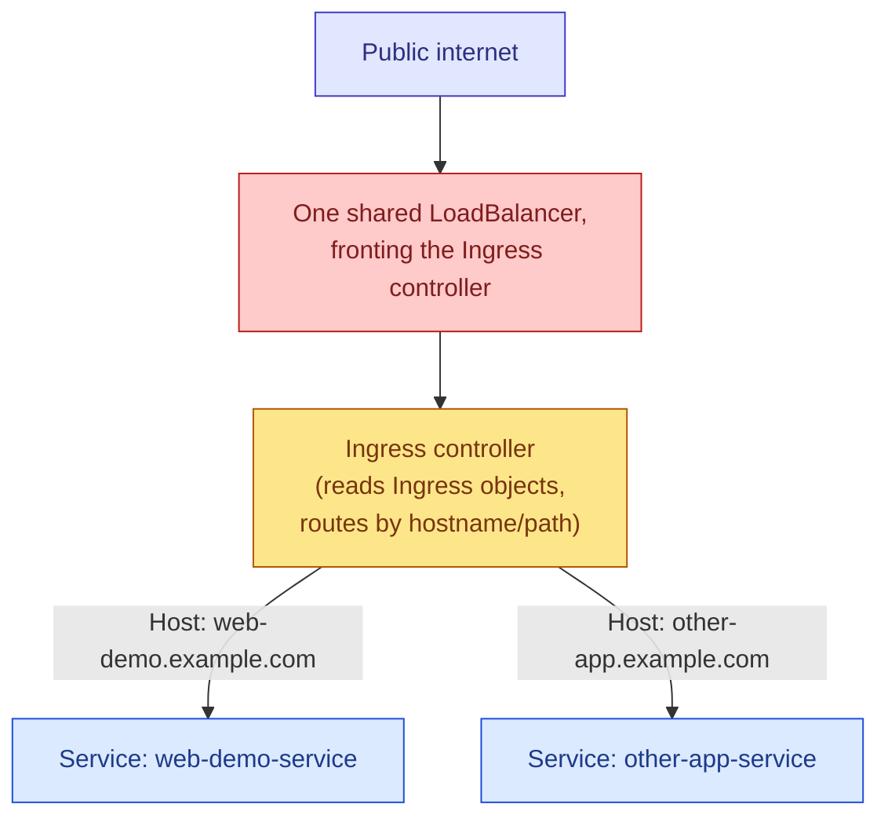
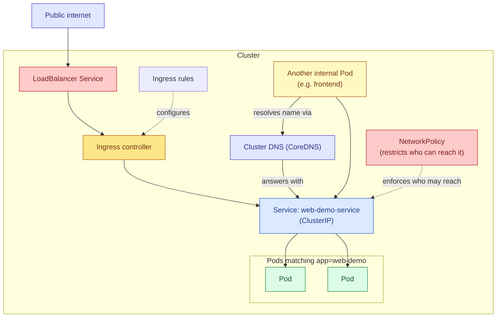

# Kubernetes Networking, End to End

## The Four Rules Kubernetes' Entire Network Model Is Built On

Before looking at any specific piece of Kubernetes networking — Services, DNS, NetworkPolicies, Ingress — it helps enormously to understand the small set of foundational guarantees that everything else is built on top of. Kubernetes doesn't actually implement networking itself; it defines a *model* that any networking plugin (a CNI plugin) installed in the cluster must satisfy, and once you understand that model, almost everything else about how traffic moves through a cluster follows logically from it.

The model requires that every Pod gets its own unique IP address, and that this IP address is real and routable from the perspective of every other Pod in the cluster — meaning any Pod can reach any other Pod's IP address directly, without Network Address Translation happening in between, regardless of which node either Pod happens to be running on. It also requires that a node can reach any Pod running on it using that Pod's own IP, without translation. Put together, this produces what's often called a "flat" network: from a Pod's own point of view, every other Pod in the entire cluster looks just as reachable as one sitting on the exact same physical node, even though in reality they might be on completely different machines, possibly in different physical racks or even different availability zones. Nothing about how you write your application needs to account for where in the cluster something else happens to be running, and that's a deliberate design decision, not an accident.



This flat, cluster-wide network is provided by whichever **CNI (Container Network Interface) plugin** the cluster is running — Calico, Cilium, Flannel, and the various cloud providers' own native implementations are all examples. Kubernetes itself defines what the resulting network must look like, but it delegates the actual work of setting up routes, tunnels, or whatever underlying mechanism achieves that model, to this pluggable component. As someone writing applications and manifests, you generally don't interact with the CNI plugin directly at all — its correctness is what makes everything described from this point onward simply work.

## Networking Inside a Single Pod: The Shared Network Namespace

Zooming in one level further than Pod-to-Pod communication, it's worth restating something covered in the notes on Pods, because it's the innermost layer of this whole picture: every container inside the same Pod shares that Pod's single network namespace entirely. This means all containers in a Pod share the exact same IP address, and a process in one container can reach a process in another container in the same Pod over `localhost`, using whatever port that other container's process happens to be listening on — no Service, no DNS lookup, nothing beyond a normal `localhost` connection, exactly like two processes running directly on the same machine.

## Getting from Unstable Pods to Something Stable: Services

The notes on Services and on the different Service types cover this in full detail, so only the essential connective point is repeated here: because Pod IP addresses are not stable — Pods are created and destroyed constantly, as covered in the Deployments notes — nothing should ever connect directly to a Pod's IP address as a long-term strategy. A **Service** sits in front of a group of Pods, selected by label, and gives that group a single stable IP address and DNS name to be reached through instead, with `kube-proxy` running on every node responsible for actually rewriting traffic destined for that stable address toward one of the real, currently-healthy Pod IPs behind it.

```yaml
apiVersion: v1
kind: Service
metadata:
  name: web-demo-service
spec:
  selector:
    app: web-demo          # finds Pods by label, not by name or IP
  ports:
    - port: 80               # what other things use to reach this Service
      targetPort: 8080        # what the container itself listens on
```

## How Names Actually Resolve: DNS Inside the Cluster

A cluster runs its own internal DNS server, almost always **CoreDNS**, itself deployed as a set of Pods inside the cluster, typically living in the `kube-system` namespace. Every Pod in the cluster is automatically configured, through its `/etc/resolv.conf`, to send DNS queries to this internal DNS server first, which is what makes Service names resolvable at all from inside a Pod, without you configuring anything extra yourself.

The full, fully-qualified name for any Service follows a predictable, fixed pattern:

```
<service-name>.<namespace>.svc.cluster.local
```

From a Pod running in the *same* namespace as the Service it's trying to reach, the short form — just the Service's name on its own — is sufficient, because the search domains automatically configured in that Pod's DNS resolution settings append the current namespace and the rest of the suffix automatically during lookup. Reaching into a *different* namespace requires at least including that namespace explicitly, as in `web-demo-service.other-namespace`, and the fully qualified form always works correctly regardless of which namespace the calling Pod happens to be in, since it leaves nothing to be filled in automatically.

Pods themselves can also get DNS entries, though this is used far less often directly — it mostly comes up in the context of a headless Service backing a StatefulSet, where each individual Pod's stable identity matters and something needs to be able to address one specific replica by name rather than being transparently load-balanced across all of them.

> From inside any Pod, you can observe this resolution directly
```bash
kubectl exec web-demo -- nslookup web-demo-service
```
> Or, testing DNS from a fresh temporary Pod
```bash
kubectl run tmp-shell --rm -it --image=busybox -- \
  nslookup web-demo-service.default.svc.cluster.local
```

## By Default, Every Pod Can Talk to Every Other Pod

This is a genuinely important fact to sit with, because it's not what most people coming from traditional network security assumptions would expect. Out of the box, with no additional configuration applied, Kubernetes' network model allows **any** Pod in the cluster to open a connection to **any** other Pod, in any namespace, on any port, with nothing blocking that traffic by default. There is no implicit isolation between namespaces, and there is no implicit isolation between unrelated applications running in the same cluster, unless something is deliberately configured to restrict it.

That "something" is a **NetworkPolicy**, and it's worth being precise about how it behaves, because the mental model is a little different from a typical firewall. A NetworkPolicy doesn't get evaluated as a global, cluster-wide firewall ruleset the way you might configure a traditional network appliance. Instead, each NetworkPolicy targets a specific set of Pods, using the same label-selector mechanism seen everywhere else in Kubernetes, and the moment even a single NetworkPolicy selects a given Pod, that Pod's networking flips from "allow everything by default" to "deny everything except what's explicitly allowed," for whichever traffic direction (ingress, egress, or both) that policy addresses. Pods that no NetworkPolicy happens to select at all remain fully open, exactly as if no NetworkPolicies existed in the cluster whatsoever.

```yaml
apiVersion: networking.k8s.io/v1
kind: NetworkPolicy
metadata:
  name: web-demo-allow-frontend-only
spec:
  podSelector:
    matchLabels:
      app: web-demo
    # This policy applies to any Pod carrying this label. The moment
    # this policy exists, these Pods stop accepting connections from
    # anywhere by default, and only the traffic explicitly allowed
    # below is still permitted through.

  policyTypes:
    - Ingress
    # This policy is restricting INCOMING traffic to the selected
    # Pods. A separate "Egress" entry here would instead restrict
    # OUTGOING traffic FROM these Pods to elsewhere — the two
    # directions are controlled completely independently, and a
    # policy can restrict one, the other, or both at once.

  ingress:
    - from:
        - podSelector:
            matchLabels:
              app: frontend
          # Only traffic originating from Pods carrying the label
          # app=frontend, in the SAME namespace as this policy, is
          # allowed through. Traffic from any other Pod, and from
          # anywhere outside the cluster entirely, is now blocked.
      ports:
        - protocol: TCP
          port: 8080
          # Even for traffic that IS from an allowed source, this
          # further restricts it to only this specific port —
          # everything else on these Pods remains inaccessible even
          # to the frontend Pods this rule otherwise allows through.
```

```yaml
apiVersion: networking.k8s.io/v1
kind: NetworkPolicy
metadata:
  name: web-demo-restrict-egress
spec:
  podSelector:
    matchLabels:
      app: web-demo
  policyTypes:
    - Egress
    # This time restricting OUTBOUND traffic FROM these Pods —
    # useful for limiting what a compromised or misbehaving Pod could
    # reach, even if it were somehow running unexpected code.
  egress:
    - to:
        - podSelector:
            matchLabels:
              app: database
      ports:
        - protocol: TCP
          port: 5432
    - to:
        - namespaceSelector: {}
      ports:
        - protocol: UDP
          port: 53
          # A very common and easy-to-forget addition: without
          # explicitly allowing outbound DNS traffic (typically on
          # port 53), an egress-restricting policy like this one can
          # accidentally break DNS resolution for these Pods entirely,
          # since DNS queries are themselves just another form of
          # outbound network traffic subject to the same rule.
```

It's worth calling out directly that a NetworkPolicy object being created does absolutely nothing on its own unless the cluster's CNI plugin actually implements NetworkPolicy enforcement. Not every CNI plugin does — some of the very simplest ones provide the flat Pod-to-Pod networking model described earlier, but silently ignore NetworkPolicy objects entirely, meaning you could apply a policy that looks correct, see no error from Kubernetes, and have it enforce nothing at all. Confirming that the specific CNI plugin in use actually supports NetworkPolicy enforcement is a genuinely important thing to check before relying on this for anything security-sensitive.

## Getting HTTP Traffic In from the Outside World: Ingress

The Service types covered in their own dedicated notes — particularly `LoadBalancer` — are one way to expose something to the outside world, but they operate at a fairly low level: a `LoadBalancer` Service gets one external IP address per Service, and it doesn't understand anything about HTTP itself, such as the request path or the `Host` header. If you have several different applications that all need to be reachable over HTTP or HTTPS from outside the cluster, giving each one its own separate cloud load balancer is both wasteful and unwieldy. An **Ingress** solves this by describing HTTP-level routing rules — which hostnames and paths should go to which internal Service — and relying on a single, shared **Ingress controller** (a separate piece of software you install into the cluster, such as ingress-nginx or Traefik) to actually read those rules and handle the real incoming traffic, typically fronted by just one `LoadBalancer` Service for the whole cluster.

```yaml
apiVersion: networking.k8s.io/v1
kind: Ingress
metadata:
  name: web-demo-ingress
spec:
  ingressClassName: nginx
  # This names which Ingress controller should handle this Ingress
  # object, relevant when more than one is installed in the cluster.

  rules:
    - host: web-demo.example.com
      # This rule only applies to incoming requests whose HTTP Host
      # header matches this hostname — the same Ingress controller
      # can host many completely different applications this way,
      # each on its own hostname, all behind one shared external IP.
      http:
        paths:
          - path: /
            pathType: Prefix
            # Prefix matching means this rule applies to this path
            # AND everything underneath it, such as /api or /static.
            backend:
              service:
                name: web-demo-service
                # This is the same internal ClusterIP Service covered
                # earlier in this document — the Ingress controller
                # itself is just another client of that Service,
                # exactly like any other Pod in the cluster would be.
                port:
                  number: 80
```



It's worth being precise that an Ingress *object* on its own does nothing at all it's purely a set of routing rules, a piece of configuration. Nothing actually happens with those rules unless an Ingress controller is running in the cluster to read and act on them, which is why "installing an Ingress controller" is a separate, necessary step that has to happen before creating any Ingress objects has any effect whatsoever.

## Putting the Whole Picture Together



## Mistakes Worth Watching For

A NetworkPolicy that restricts egress traffic without also explicitly permitting outbound DNS queries is a mistake specific enough, and common enough, to deserve repeating on its own: it will typically break the affected Pods' ability to resolve any name at all, including Service names inside the same cluster, because the DNS query itself is outbound traffic subject to that same restrictive rule.

A second mistake is applying a NetworkPolicy and assuming it took effect, when the cluster's CNI plugin doesn't actually implement NetworkPolicy enforcement at all. Because Kubernetes accepts and stores the NetworkPolicy object regardless of whether anything downstream enforces it, there's no error to alert you that nothing is actually being restricted — confirming enforcement support for your specific CNI plugin ahead of time avoids a false sense of security here.

A third mistake is creating Ingress objects while assuming they alone are sufficient, without an Ingress controller actually running in the cluster to act on them. The Ingress object will sit there validly, and requests to the intended hostname simply won't go anywhere, because nothing is listening on the other end to interpret those routing rules.

## Quick Reference

> Confirm Pod IPs and which node each Pod landed on
```bash
kubectl get pods -o wide
```
> Confirm a Service actually has healthy Pods behind it
```bash
kubectl get endpoints web-demo-service
```
> Test DNS resolution from inside the cluster's own network
```bash
kubectl run tmp-shell --rm -it --image=busybox -- nslookup web-demo-service
```
> List NetworkPolicies currently applied, and see exactly what a
> specific one is restricting
```bash
kubectl get networkpolicy
```
```bash
kubectl describe networkpolicy web-demo-allow-frontend-only
```
> List Ingress objects and confirm which controller and hostnames
> they're configured for
```bash
kubectl get ingress
```
```bash
kubectl describe ingress web-demo-ingress
```