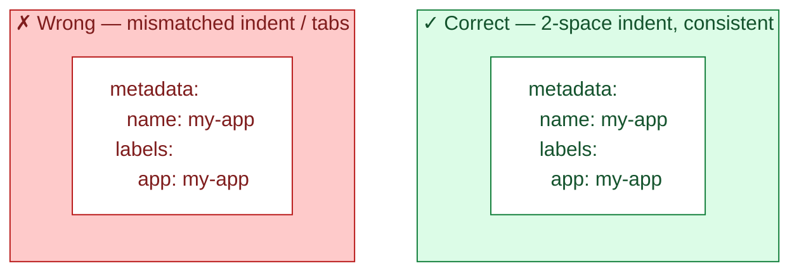
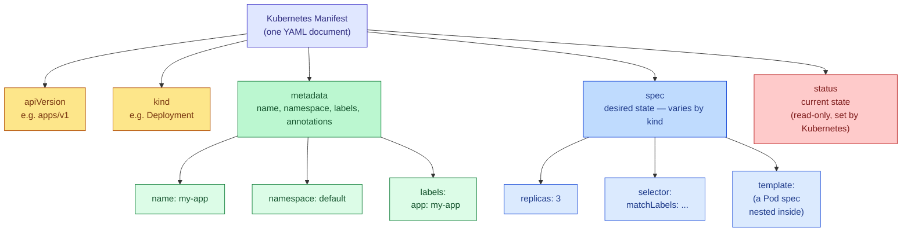

# Writing YAML for Kubernetes

A practical guide to YAML syntax itself, and the specific parts every Kubernetes manifest is built from.

---

## 1. What YAML Actually Is

YAML ("YAML Ain't Markup Language") is a human-readable data format built entirely on **indentation and key-value pairs** — no braces, no closing tags. Kubernetes uses it to describe *desired state*: "I want this many replicas of this container, with this config."

```yaml
key: value
nested:
  key: value
list:
  - item1
  - item2
```

### The rules that actually matter

| Rule | Why it matters |
|---|---|
| **Indentation = structure.** Use **spaces only, never tabs.** | A tab character is invisible but breaks parsing instantly — this is the #1 cause of YAML errors. |
| Indentation must be **consistent** at each level (2 spaces is the Kubernetes convention). | Mixing 2 and 4 spaces at the same level is a syntax error. |
| `key: value` needs a **space after the colon**. | `key:value` (no space) is parsed as a plain string, not a key-value pair. |
| Lists use a leading dash `- `. | Each `-` is one item in an array. |
| Strings usually don't need quotes, but quote them when they contain `:`, `#`, start with a number-like value, or are booleans-as-strings (`"yes"`, `"true"`). | Kubernetes will otherwise silently coerce `port: 80` to a number, or `enabled: yes` to a boolean, which may not be what you want. |
| `#` starts a comment. | Everything after it on that line is ignored. |
| `---` separates multiple YAML documents in one file. | Lets you define a Deployment *and* a Service in a single `.yaml` file. |
| `null` / `~` / empty value all mean "no value". | Useful, but easy to create by accident (a key with nothing after the colon). |

### Indentation, visually



---

## 2. The Anatomy of a Kubernetes Manifest

Almost every Kubernetes YAML file — regardless of whether it describes a Pod, Deployment, Service, or ConfigMap — has the **same four top-level fields**:

```yaml
apiVersion: apps/v1     # which API group/version defines this object
kind: Deployment        # what type of object this is
metadata:               # identifying information
  name: my-app
spec:                   # the desired state you're asking for
  ...
```



### `apiVersion`
Tells Kubernetes which version of the API to use for this object. Different kinds live in different API groups:

| Kind | apiVersion |
|---|---|
| Pod, Service, ConfigMap, Secret, Namespace | `v1` (the "core" group, no prefix) |
| Deployment, ReplicaSet, StatefulSet, DaemonSet | `apps/v1` |
| Ingress | `networking.k8s.io/v1` |
| Job, CronJob | `batch/v1` |
| Role, RoleBinding | `rbac.authorization.k8s.io/v1` |

If you're not sure, `kubectl explain <kind>` tells you the correct `apiVersion`.

### `kind`
The type of object you're creating — `Pod`, `Deployment`, `Service`, `ConfigMap`, `Secret`, `Ingress`, `Job`, `Namespace`, etc. This determines what fields are valid inside `spec`.

### `metadata`
Identifying information about the object — not its behavior, just *what it's called and how it's tagged*.

```yaml
metadata:
  name: my-app                 # required, must be unique within the namespace
  namespace: production        # optional, defaults to "default"
  labels:                      # arbitrary key-value tags used for selection
    app: my-app
    tier: backend
  annotations:                 # arbitrary metadata, not used for selection
    owner: "platform-team"
```

- **`labels`** are how other objects *find* this one (a Service uses labels to know which Pods to send traffic to). Keep them short and structured.
- **`annotations`** are for arbitrary information tools/humans want attached (build info, descriptions) — Kubernetes itself never selects on annotations.

### `spec`
The desired state — **this is the part that differs the most by `kind`.** A Deployment's `spec` describes replica count and a Pod template; a Service's `spec` describes ports and a selector; a ConfigMap doesn't have a `spec` at all (it uses `data` instead). You always need to check the docs or `kubectl explain` for the specific kind.

### `status` (you don't write this)
Kubernetes fills this in itself once the object exists — current replica count, conditions, IP addresses. You'll see it when you run `kubectl get pod my-app -o yaml`, but you never write it by hand in a manifest you're applying.

---

## 3. Worked Examples

### A Pod (the simplest real object)

```yaml
apiVersion: v1
kind: Pod
metadata:
  name: my-pod
  labels:
    app: my-app
spec:
  containers:
    - name: nginx              # list item: this Pod could have multiple containers
      image: nginx:1.27
      ports:
        - containerPort: 80
      env:
        - name: ENVIRONMENT
          value: "production"
      resources:
        requests:
          cpu: "100m"           # 100 millicores = 0.1 CPU
          memory: "128Mi"
        limits:
          cpu: "250m"
          memory: "256Mi"
```

### A Deployment (manages Pods for you)

```yaml
apiVersion: apps/v1
kind: Deployment
metadata:
  name: my-app
  labels:
    app: my-app
spec:
  replicas: 3
  selector:
    matchLabels:
      app: my-app             # must match template.metadata.labels below
  template:                   # this is a full Pod spec, nested
    metadata:
      labels:
        app: my-app
    spec:
      containers:
        - name: nginx
          image: nginx:1.27
          ports:
            - containerPort: 80
```

Notice `template` is a **Pod spec nested inside a Deployment spec** — the Deployment's job is just to stamp out copies of that Pod template and keep the replica count correct.

### A Service (stable network endpoint for Pods)

```yaml
apiVersion: v1
kind: Service
metadata:
  name: my-app-service
spec:
  selector:
    app: my-app                # routes traffic to any Pod with this label
  ports:
    - protocol: TCP
      port: 80                 # port the Service exposes
      targetPort: 80           # port the container actually listens on
  type: ClusterIP              # or NodePort, LoadBalancer
```

The `selector` here is what connects a Service to Pods — it's matching on the **labels** you set in `metadata.labels` on the Pod (or Deployment template) above.

### A ConfigMap (plain config data, no `spec`)

```yaml
apiVersion: v1
kind: ConfigMap
metadata:
  name: my-app-config
data:
  APP_ENV: "production"
  LOG_LEVEL: "info"
  config.json: |                # the `|` keeps multi-line text as-is
    {
      "feature_flags": {
        "new_ui": true
      }
    }
```

### Multiple objects in one file

```yaml
apiVersion: apps/v1
kind: Deployment
metadata:
  name: my-app
spec:
  replicas: 3
  selector:
    matchLabels:
      app: my-app
  template:
    metadata:
      labels:
        app: my-app
    spec:
      containers:
        - name: nginx
          image: nginx:1.27
---
apiVersion: v1
kind: Service
metadata:
  name: my-app-service
spec:
  selector:
    app: my-app
  ports:
    - port: 80
      targetPort: 80
```

`kubectl apply -f file.yaml` will create both objects — the `---` is what splits them into two documents.

---

## 4. Common Mistakes

| Mistake | What happens |
|---|---|
| Using a tab instead of spaces | Immediate parse error: `error converting YAML to JSON` |
| Inconsistent indentation between sibling keys | Parse error or the key silently attaches to the wrong parent |
| `selector.matchLabels` not matching `template.metadata.labels` | Deployment is rejected: *"selector does not match template labels"* |
| Forgetting quotes around `"yes"`, `"no"`, `"true"`, `"on"` | YAML 1.1 parsers treat these as booleans, not strings — can silently break string fields |
| Writing a port number as unquoted but starting with `0` (e.g. `port: 080`) | YAML may parse it as octal — always fine for normal ports, but worth knowing |
| Missing `-` before a list item | Turns what you meant as a list entry into a nested map instead |
| Copy-pasting YAML from two different indent widths | The most common source of "works on my machine" manifest errors |

---

## 5. Validating Before You Apply

```bash
# Check syntax and what Kubernetes would do, without actually doing it
kubectl apply -f my-app.yaml --dry-run=client -o yaml

# Validate against the live cluster's API (catches invalid fields for that kind)
kubectl apply -f my-app.yaml --dry-run=server

# See what fields a kind supports, and which are required
kubectl explain deployment.spec
kubectl explain deployment.spec.template.spec.containers

# Lint your YAML syntax itself (indentation, structure) before it ever reaches kubectl
yamllint my-app.yaml
```

`kubectl explain <kind>.<field>` is the fastest way to answer "what goes here?" without leaving the terminal — it walks the exact schema Kubernetes expects for that field.

---

## 6. Quick Reference

```yaml
apiVersion: <group>/<version>   # which API this kind belongs to
kind: <ObjectType>              # Pod, Deployment, Service, ConfigMap, ...
metadata:
  name: <string>                 # required, unique per namespace
  namespace: <string>            # optional, defaults to "default"
  labels: { <key>: <value> }     # used for selection by other objects
  annotations: { <key>: <value> }# used for arbitrary metadata, not selection
spec:
  ...                             # shape depends entirely on `kind`
status:                          # read-only, filled in by Kubernetes
  ...
```