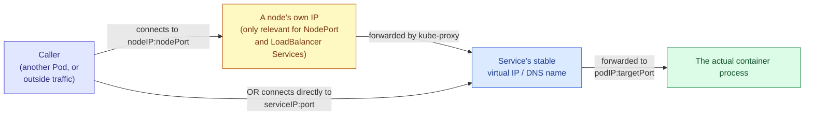

# `port`, `targetPort`, and `nodePort` in a Kubernetes Service

## Why This Needs Its Own Explanation

These three fields all hold a number that looks like a network port, they all live under the same `ports:` entry in a Service manifest, and yet they each mean something genuinely different, describing three different points along the path traffic takes on its way to your actual container. A huge amount of confusion around Services traces directly back to treating these as interchangeable, or assuming they must always be set to the same value, when in fact they're independently configurable precisely because the layer each one describes can reasonably be different from the others.

The clearest way to understand them is to follow a single request as it travels from wherever it started, all the way down to the process actually listening inside a container, and name each field at the exact point where it applies.



## `port` — the Number Other Things Use to Reach the Service Itself

This is the port exposed on the Service's own stable virtual IP address and DNS name — the one covered in the notes on Services and DNS. Whenever anything inside the cluster connects to this Service by its name or its ClusterIP, this is the port number they connect to. It has no direct, forced relationship to what the container is actually listening on; it's simply the "public-facing" port number for this Service, as far as the rest of the cluster is concerned.

```yaml
apiVersion: v1
kind: Service
metadata:
  name: web-demo-service
spec:
  selector:
    app: web-demo
  ports:
    - port: 80
      # Anything inside the cluster reaches this Service using this
      # port number — for example, http://web-demo-service:80, or
      # simply http://web-demo-service, since 80 is the default port
      # web browsers and most HTTP clients assume when none is given.
      targetPort: 8080
```

A genuinely useful reason to make `port` different from `targetPort`, rather than just matching them out of habit, is presenting a conventional, expected port to everything that consumes this Service, regardless of what the application inside the container happens to actually bind to. In the example above, every other Pod in the cluster gets to treat `web-demo-service` as a normal web service reachable on the standard HTTP port 80, even though the actual `web-demo` container was written, for whatever reason, to listen on port 8080 internally. Nobody calling this Service needs to know or care about that internal detail at all.

## `targetPort` — the Number the Container Is Actually Listening On

This is the port on the actual Pod that traffic gets forwarded to once it reaches the Service. It must match whatever port the container's own process has genuinely bound to and is listening on — get this wrong, and connections to the Service will reach the right Pod but then fail, because nothing inside that Pod is actually listening on the port the Service is trying to forward to.

```yaml
apiVersion: v1
kind: Pod
metadata:
  name: web-demo
  labels:
    app: web-demo
spec:
  containers:
    - name: web-demo
      image: web-demo:1.0
      ports:
        - containerPort: 8080
          # This documents which port the process inside this
          # container listens on. It's informational and
          # self-documenting for anyone reading this manifest, but
          # Kubernetes does not use it to automatically configure any
          # Service's targetPort for you — the two are written
          # independently, and it's entirely possible (though
          # confusing) for them to disagree.
```

Given the Pod above, a Service intending to route to it correctly must set `targetPort: 8080`, matching the actual `containerPort` the application binds to — that number came from how the application itself was written or configured, not from anything Kubernetes decides on your behalf.

`targetPort` also accepts a **name** instead of a number, which can be worth using specifically because it decouples a Service's configuration from having to know the exact numeric port at all, as long as the Pod's own container port is given that same name.

```yaml
# In the Pod:
ports:
  - name: http
    containerPort: 8080

# In the Service, referencing that name instead of the raw number:
ports:
  - port: 80
    targetPort: http
```

This is particularly useful if the underlying container image's listening port might change between versions — updating the `containerPort` number in one place, while leaving the Service's `targetPort: http` untouched, keeps the whole thing working without editing the Service at all.

## `nodePort` — the Number Opened on Every Node's Own IP Address

This field only applies to Services of type `NodePort` or `LoadBalancer` — the two types covered in the dedicated notes on Service types that actually expose something on a node's own address. When set, this is the fixed port number that gets opened on **every single node** in the cluster, regardless of whether that specific node happens to be running any of the matching Pods, forwarding any traffic that arrives there onward to the Service, which then routes it to `targetPort` on an actual Pod exactly as described above.

```yaml
apiVersion: v1
kind: Service
metadata:
  name: web-demo-service
spec:
  type: NodePort
  selector:
    app: web-demo
  ports:
    - port: 80
      # Still relevant here too — this is the port used when
      # something INSIDE the cluster reaches this Service normally,
      # completely independent of the NodePort mechanism.
      targetPort: 8080
      # Still the container's actual listening port, unchanged from
      # everything explained above.
      nodePort: 30080
      # This is the NEW piece specific to NodePort Services: a port,
      # restricted to a fairly high range (30000-32767 by default),
      # opened on every node's own IP address. A client reaching
      # <any-node-ip>:30080 gets routed through to this Service, and
      # from there onward exactly as described for "port" above.
```

If `nodePort` is left unset on a `NodePort` or `LoadBalancer` Service, Kubernetes automatically assigns an available number from within that reserved range for you, rather than requiring you to pick and track one manually.

## Seeing All Three at Once, End to End

```yaml
apiVersion: v1
kind: Pod
metadata:
  name: web-demo
  labels:
    app: web-demo
spec:
  containers:
    - name: web-demo
      image: web-demo:1.0
      ports:
        - name: http
          containerPort: 8080
          # The container genuinely listens here. This number came
          # from the application itself, not from Kubernetes.
---
apiVersion: v1
kind: Service
metadata:
  name: web-demo-service
spec:
  type: NodePort
  selector:
    app: web-demo
  ports:
    - port: 80
      # Layer 1 — how other Pods inside the cluster reach this
      # Service, by its stable name or ClusterIP.
      targetPort: http
      # Layer 2 — where the traffic actually goes once it reaches a
      # Pod: the container's real listening port, referenced here by
      # the name given to it in the Pod spec above.
      nodePort: 30080
      # Layer 3 — an additional, outermost entry point, reachable on
      # any node's own IP address from outside the cluster entirely.
```

Walking through what happens for two different callers makes the layering concrete. Another Pod inside the cluster, calling `http://web-demo-service`, connects using `port: 80`, and that connection gets forwarded internally to whichever Pod is selected, landing on `targetPort: http`, which resolves to `containerPort: 8080` on that Pod — the `nodePort` value never enters into this path at all, because this caller never went anywhere near a node's own IP address. A client outside the cluster, on the other hand, connecting to `<any-node-ip>:30080`, arrives via the `nodePort`, gets forwarded to the Service exactly as the internal caller's traffic eventually was, and from there follows the same `targetPort` path down to `containerPort: 8080` on the actual Pod. Both callers end up at the same container, on the same real listening port, having gone through different entry points to get there.

## Mistakes Worth Watching For

The most common mistake is a `targetPort` that doesn't actually match the container's real listening port — often left over from copying a manifest template and forgetting to update this one number to match a different application. The symptom is distinctive and worth recognizing: `kubectl get endpoints` will show the Service has found Pods and considers them healthy, because that's governed by labels and readiness, not by whether the target port is correct, yet every actual connection attempt to the Service fails or times out, because nothing is listening on the port traffic is being forwarded to.

A second mistake is assuming `nodePort` needs to match `port` or `targetPort` in any way. All three are independent numbers, and there is no requirement or convention that they line up — `nodePort` is deliberately restricted to its own separate high-numbered range specifically because it's a distinct, outward-facing entry point rather than a mirror of the other two.

A third, subtler mistake is forgetting that `nodePort` and `LoadBalancer` Services open their port on **every** node, not just nodes currently running a matching Pod, and being surprised when a firewall or security group rule that only allowed traffic to "the nodes running this application" turns out to have blocked legitimate traffic arriving at a different node that also has this port open and would have forwarded it along correctly.

## Quick Reference

| Field | Where it applies | What it must match |
|---|---|---|
| `port` | The Service's own stable virtual IP / DNS name | Nothing in particular — your choice, for the cluster-internal convention you want to present |
| `targetPort` | Where traffic lands on the actual Pod | The container's real listening port (`containerPort`), or its name |
| `nodePort` | Every node's own IP address (NodePort/LoadBalancer only) | Nothing in particular — your choice within the reserved range, or left unset for auto-assignment |

```bash
# Confirm exactly what a Service is currently configured with for
# all three of these fields
kubectl get service web-demo-service -o yaml
```