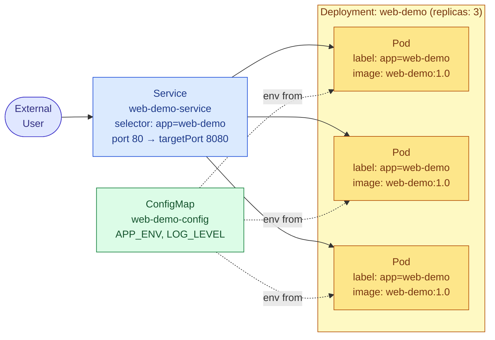

# Kubernetes Manifests: A Hands-On Lesson (using `web-demo`)

This lesson walks through building a real set of Kubernetes manifests from scratch for a small app called **`web-demo`**, explaining every field as we go. By the end you'll have a Namespace, ConfigMap, Deployment, and Service that work together.

---

## 1. The Scenario

We're deploying `web-demo`, a simple web app packaged as a container image `web-demo`, listening on port `8080` inside the container. We want:

- 3 replicas running at all times
- Configuration (environment, log level) injected without rebuilding the image
- A stable internal address other services (or a load balancer) can reach it at

Here's what we're building, end to end:



The **Service** routes traffic to any **Pod** carrying the label `app=web-demo`. Those Pods are created and kept alive by the **Deployment**. The **ConfigMap** supplies environment variables into each Pod without touching the image itself.

---

## 2. Step 1 — A Namespace to keep things isolated

```yaml
apiVersion: v1
kind: Namespace
metadata:
  name: web-demo
```

This just creates a logical bucket called `web-demo`. Everything else below will live inside it via `metadata.namespace: web-demo`. This step is optional for a demo, but it's good habit — it keeps `web-demo`'s objects separate from everything else in the cluster.

---

## 3. Step 2 — A ConfigMap for configuration

```yaml
apiVersion: v1
kind: ConfigMap
metadata:
  name: web-demo-config
  namespace: web-demo
data:
  APP_ENV: "production"
  LOG_LEVEL: "info"
  GREETING: "Hello from web-demo!"
```

- `kind: ConfigMap` objects don't have a `spec` — they use `data` directly, since they're just holding key-value strings.
- Each key under `data` becomes something we can inject into a container as an environment variable (shown next) or mount as a file.

---

## 4. Step 3 — The Deployment (this is the core object)

```yaml
apiVersion: apps/v1
kind: Deployment
metadata:
  name: web-demo
  namespace: web-demo
  labels:
    app: web-demo
spec:
  replicas: 3                    # how many identical Pods to keep running
  selector:
    matchLabels:
      app: web-demo              # must exactly match template.metadata.labels
  template:                      # this whole block is a Pod spec
    metadata:
      labels:
        app: web-demo            # every Pod created gets this label
    spec:
      containers:
        - name: web-demo
          image: web-demo:1.0    # the container image to run
          ports:
            - containerPort: 8080
          envFrom:
            - configMapRef:
                name: web-demo-config   # pulls in every key from the ConfigMap
          resources:
            requests:
              cpu: "100m"
              memory: "128Mi"
            limits:
              cpu: "250m"
              memory: "256Mi"
          readinessProbe:
            httpGet:
              path: /healthz
              port: 8080
            initialDelaySeconds: 3
            periodSeconds: 5
```

Field by field:

| Field | What it's doing |
|---|---|
| `spec.replicas: 3` | Kubernetes will always try to keep exactly 3 Pods matching this template alive. |
| `spec.selector.matchLabels` | Tells the Deployment which Pods belong to it. **Must match** the labels under `template.metadata.labels`, or Kubernetes rejects the manifest. |
| `spec.template` | A full Pod specification, nested. This is the "cookie cutter" the Deployment stamps out 3 times. |
| `containers[].image: web-demo:1.0` | The actual image + tag to pull and run. Pin a specific tag (not `latest`) so deployments are predictable. |
| `containers[].ports` | Documents which port the container listens on — informational for humans/tools, doesn't open anything by itself. |
| `envFrom.configMapRef` | Injects every key in `web-demo-config` as an environment variable, so `APP_ENV`, `LOG_LEVEL`, `GREETING` are all available inside the container. |
| `resources.requests` / `limits` | `requests` is what the scheduler reserves for this Pod when picking a node; `limits` is the hard ceiling the container can't exceed. |
| `readinessProbe` | Kubernetes won't send traffic to a Pod until this check passes — protects against sending requests to a Pod that's still starting up. |

---

## 5. Step 4 — The Service (stable address for the Pods)

```yaml
apiVersion: v1
kind: Service
metadata:
  name: web-demo-service
  namespace: web-demo
spec:
  selector:
    app: web-demo        # sends traffic to any Pod with this label
  ports:
    - protocol: TCP
      port: 80            # the port other things talk to the Service on
      targetPort: 8080    # the port the container actually listens on
  type: ClusterIP          # internal-only address; use LoadBalancer to expose externally
```

Note the `selector` here is doing the same kind of matching the Deployment does — it's how the Service finds the right Pods purely by label, without knowing (or caring) how many Pods exist or which node they're on.

---

## 6. Putting It All Together

You can keep these as four separate files, or combine them into one, separated by `---`:

```yaml
apiVersion: v1
kind: Namespace
metadata:
  name: web-demo
---
apiVersion: v1
kind: ConfigMap
metadata:
  name: web-demo-config
  namespace: web-demo
data:
  APP_ENV: "production"
  LOG_LEVEL: "info"
  GREETING: "Hello from web-demo!"
---
apiVersion: apps/v1
kind: Deployment
metadata:
  name: web-demo
  namespace: web-demo
  labels:
    app: web-demo
spec:
  replicas: 3
  selector:
    matchLabels:
      app: web-demo
  template:
    metadata:
      labels:
        app: web-demo
    spec:
      containers:
        - name: web-demo
          image: web-demo:1.0
          ports:
            - containerPort: 8080
          envFrom:
            - configMapRef:
                name: web-demo-config
---
apiVersion: v1
kind: Service
metadata:
  name: web-demo-service
  namespace: web-demo
spec:
  selector:
    app: web-demo
  ports:
    - protocol: TCP
      port: 80
      targetPort: 8080
  type: ClusterIP
```

Save this as `web-demo.yaml` and apply it:

```bash
kubectl apply -f web-demo.yaml
```

Kubernetes creates the objects **in the order it makes sense to**, not strictly top-to-bottom — but listing the Namespace first is still good practice since later objects reference it.

---

## 7. Checking Your Work

```bash
# See everything that got created in the namespace
kubectl get all -n web-demo

# Confirm 3/3 Pods are ready
kubectl get deployment web-demo -n web-demo

# Check the Pods actually have the right label
kubectl get pods -n web-demo --show-labels

# Confirm the Service found its Pods (should list 3 endpoints)
kubectl get endpoints web-demo-service -n web-demo

# Reach the app from inside the cluster
kubectl run tmp-shell --rm -it --image=busybox -n web-demo -- \
  wget -qO- http://web-demo-service
```

If `kubectl get endpoints` shows **no addresses**, the most common cause is a label mismatch — double check that `spec.selector` on the Service exactly matches `spec.template.metadata.labels` on the Deployment.

---

## 8. Making a Change

Manifests are declarative — to change something, edit the YAML and re-apply:

```bash
# Bump to 5 replicas
kubectl apply -f web-demo.yaml   # after editing replicas: 5 in the file

# Roll out a new image version with zero downtime
kubectl set image deployment/web-demo web-demo=web-demo:1.1 -n web-demo

# Watch the rollout happen
kubectl rollout status deployment/web-demo -n web-demo

# Roll back if something's wrong
kubectl rollout undo deployment/web-demo -n web-demo
```

---

## 9. Recap: What Each Object Was For

| Object | Purpose | Key connector |
|---|---|---|
| `Namespace` | Logical isolation boundary | referenced by `metadata.namespace` on everything else |
| `ConfigMap` | Holds config values | pulled in via `envFrom.configMapRef.name` |
| `Deployment` | Keeps N Pods running the `web-demo:1.0` image alive | `spec.selector` must match `template.metadata.labels` |
| `Service` | Stable network address routing to those Pods | `spec.selector` must match the Pods' labels |

The pattern to remember: **labels are the glue.** Nothing here references anything else by name except the ConfigMap — Deployments and Services find their Pods purely through label matching, which is what lets Kubernetes reshuffle, reschedule, and scale Pods without anything breaking.