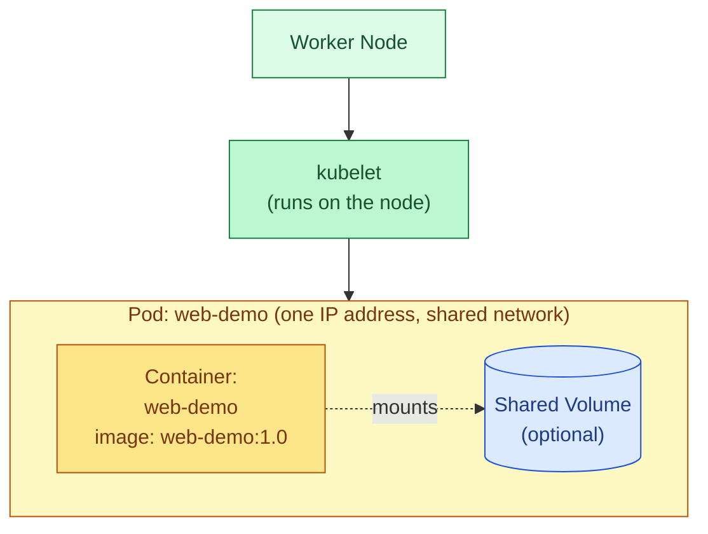

# Kubernetes Pods: A Short Lecture

## What a Pod Actually Is

A **Pod** is the smallest deployable unit in Kubernetes. Not a container — a Pod. That distinction matters:

- A Pod wraps **one or more containers** that are meant to run together, on the same machine, sharing the same network and storage.
- Every container in a Pod shares the **same IP address and port space** — they talk to each other over `localhost`, exactly like processes on the same machine.
- Every container in a Pod can share **volumes** — the same mounted directories.
- Containers in a Pod are always **scheduled together**, **started together**, and **die together**. You never get "half a Pod" running.

Most Pods run exactly one container. The multi-container case exists for tightly coupled helpers — a "sidecar" that ships logs, a proxy that handles TLS, an init step that prepares files — not for running unrelated services next to each other.



## Why Pods Exist at All (Instead of Just Containers)

Docker already runs containers. Kubernetes could have made "container" the base unit — but it didn't, for a good reason: **some things genuinely need to run as a tightly-coupled group**, sharing network and disk, and Kubernetes needed a name for "one unit of scheduling." That's the Pod.

## Key Facts About Pods

| Fact | Why it matters |
|---|---|
| Pods are **ephemeral**. | If a Pod dies, it is *not* restarted in place — a new Pod with a new IP and new name is created instead. Never hard-code a Pod's IP anywhere. |
| You (almost) never create Pods directly in production. | A bare Pod has no self-healing — if the node dies, it's gone for good. Instead you use a **Deployment**, which creates and manages Pods for you, replacing them automatically. |
| Every Pod gets its own **cluster-internal IP address**. | This is what lets containers inside the Pod reach each other on `localhost`, and lets other Pods reach this one over the network. |
| Pods are assigned to exactly **one Node** and stay there for their lifetime. | If that node fails, the Pod is gone — a controller (like a Deployment) is what notices and creates a replacement, possibly on a different node. |
| A container restarting inside a Pod (e.g. a crash) does **not** create a new Pod. | The Pod's identity, IP, and volumes stay the same; only the container process restarts. |

## Reading a Pod's Status

```bash
kubectl get pods                    # quick list: name, ready count, status, restarts, age
kubectl describe pod web-demo       # full detail: events, conditions, container states
kubectl logs web-demo               # stdout/stderr of the (single) container
kubectl logs web-demo -c <name>     # needed when the Pod has multiple containers
```

The `STATUS` column you'll see most often:

| Status | Meaning |
|---|---|
| `Pending` | Pod accepted, but not yet scheduled or its image is still being pulled |
| `ContainerCreating` | Scheduled, container runtime is setting it up |
| `Running` | At least one container is running |
| `CrashLoopBackOff` | The container keeps crashing and Kubernetes is backing off before retrying |
| `Completed` | Container(s) exited with status 0 (normal for one-off Jobs) |
| `Error` | Container(s) exited with a non-zero status |

---

## A Fully Commented Example: `web-demo`

Below is a single Pod running one container from the image `web-demo`. Every line is explained inline.

```yaml
apiVersion: v1                       
# Pods live in the "core" API group, so the version
# has no group prefix — just "v1". (Compare this to
# a Deployment, which uses "apps/v1".)
kind: Pod                            
# Tells Kubernetes what kind of object this manifest
# describes. This determines which fields are valid
# inside `spec` below.
metadata:                           
# Identifying information about this object — not
# its behavior, just what it's called and how it's tagged.
  name: web-demo                     
# The Pod's name. Must be unique within its namespace.
# This is how you refer to it with kubectl (e.g.
# `kubectl logs web-demo`).
  labels:                           
# Arbitrary key-value tags used for *selection*.
# Services and other objects find this Pod by
# matching on these labels — not by name.
    app: web-demo                    
# Convention: "app" identifies which application
# this Pod belongs to. A Service's selector would
# target `app: web-demo` to route traffic here.
    tier: backend                  
# An extra descriptive label — purely informational
# unless something explicitly selects on it too.
spec:                                
# The desired state of the Pod: what to run and how.
  containers:                        
# A list of containers to run inside this Pod.
# Almost always just one entry in practice.
    - name: web-demo                 
# The container's name *within the Pod*. Used when
# you have multiple containers and need to target
# one specifically, e.g. `kubectl logs web-demo -c web-demo`.
      image: web-demo:1.0            
# The container image to pull and run, with an
# explicit tag. Always pin a specific tag (never
# `latest`) so what runs is predictable and
# reproducible across restarts and rollouts.
      ports:                         
# Documents which port(s) the container listens on.
# This is informational/self-documenting — it does
# NOT open the port or make it reachable by itself.
        - containerPort: 8080        
# The actual port the process inside the container
# binds to. A Service would target this port via
# `targetPort` to route traffic in.
```

### What Happens When You `kubectl apply -f` This

1. The API server validates the YAML and stores this Pod's *desired state* in etcd.
2. The scheduler sees an unscheduled Pod, checks its `resources.requests`, and picks a Node with enough free CPU/memory.
3. The kubelet on that Node notices a Pod has been assigned to it, pulls `web-demo:1.0`, and starts the container.
4. Kubernetes starts polling the `readinessProbe` — until `/healthz` returns success, this Pod is marked `NotReady` and excluded from any Service's traffic routing.
5. Once ready, the Pod is `Running` and `1/1 Ready`, and the `livenessProbe` keeps polling in the background for as long as the Pod exists.

### One Thing to Remember

This Pod, on its own, has **no self-healing** — if its Node dies, it's simply gone. In practice you'd almost never write a bare Pod like this for a real service; you'd wrap this exact same `spec` inside a **Deployment**'s `template`, and let the Deployment keep the desired number of replicas alive, reschedule them on failure, and roll out new versions for you.