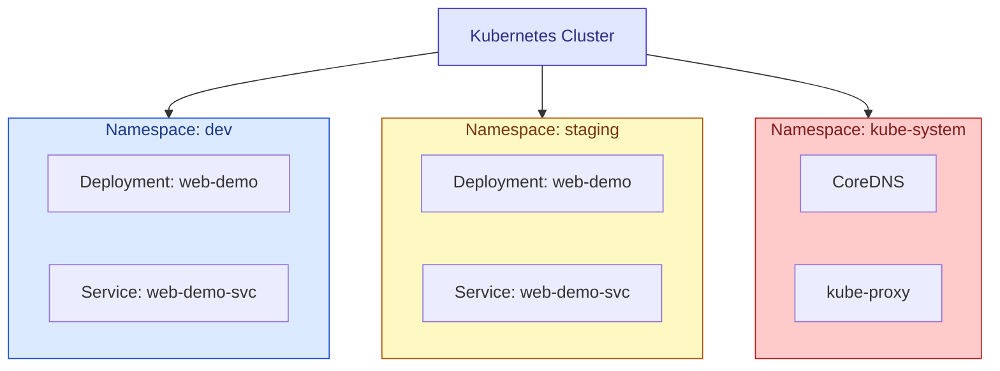

# Kubernetes Namespaces

## What They Are

A **Namespace** is a way to divide a single cluster into multiple virtual clusters. It's a scoping mechanism  most Kubernetes objects (Pods, Deployments, Services, ConfigMaps, etc.) live *inside* a namespace, and by default only interact with other objects in that same namespace.



Notice `dev` and `staging` both have a Deployment and Service **named the same thing** that's fine, because names only need to be unique *within* a namespace, not across the whole cluster.

## Why They Exist

| Use case | How namespaces help |
|---|---|
| Multiple teams/environments sharing one cluster | `dev`, `staging`, `prod` as separate namespaces avoid name collisions and accidental cross-talk |
| Access control | RBAC `RoleBinding`s can grant permissions scoped to a single namespace |
| Resource limits | A `ResourceQuota` can cap total CPU/memory a namespace is allowed to consume |
| Cleanup | Deleting a namespace deletes everything inside it — handy for tearing down a whole environment at once |

## Default Namespaces Kubernetes Creates for You

| Namespace | Purpose |
|---|---|
| `default` | Where objects go if you don't specify a namespace |
| `kube-system` | Cluster-internal components (CoreDNS, kube-proxy, etc.) — don't touch |
| `kube-public` | Readable by everyone, even unauthenticated users — rarely used |
| `kube-node-lease` | Node heartbeat data used internally by Kubernetes |

## What Namespaces Do *Not* Isolate

- **Nodes** — a Node isn't in any namespace; it's a cluster-wide resource.
- **Network, by default** — Pods in different namespaces can reach each other over the network unless you add a `NetworkPolicy` to block it. Namespaces are an organizational boundary, not a security boundary, unless you enforce one.
- **Cluster-scoped objects** — things like `Node`, `PersistentVolume`, `ClusterRole`, and `Namespace` itself don't belong to any namespace.

## Using Namespaces
>create a file called kimbi-namespace.yaml copy past this
```yaml
apiVersion: v1
kind: Namespace
metadata:
  name: kimbi        # creates a new namespace called "web-demo"
```

>create a file called kimbi-pod.yaml copy paste this
```yaml

apiVersion: v1                     
kind: Pod                            
metadata:                           
  name: web-demo
  namespace: kimbi  # creating this pod in namespace called kimbi               
  labels:                           
    app: web-demo                                    
spec:                                
  containers:                        
    - name: web-demo                 
      image: web-demo
      imagePullPolicy: Never  # Uses your local image without checking an online registry        
      ports:                         
        - containerPort: 8080        
```


> Create namesspace
```bash
kubectl apply -f kimbi-namespace.yaml
```
> List all namespaces
```bash
kubectl get namespaces
```
>create pod in kimbi namespace
```bash
kubectl apply -f kimbi-pod
```
> List Pods in a default namespace
```bash
kubectl get pods
```
> you should see node resouces in default namespace

> List Pods in a kimbi namespace
```bash
kubectl get pods -n kimbi
```
> List Pods across ALL namespaces
```bash
kubectl get pods --all-namespaces
```
>Delete podes in kimbi namespace
```bash
kubectl delete pod web-demo -n kimbi
```
> Set a default namespace for your current kubectl context
> (so you stop typing -n web-demo every time)
```bash
kubectl config set-context --current --namespace=kimbi
```
> Delete a namespace — and everything inside it
```bash
kubectl delete namespace kimbi
```

## Cross-Namespace Communication

A Service in one namespace can be reached from another namespace using its **fully qualified DNS name**:

```
<service-name>.<namespace>.svc.cluster.local
```

e.g. a Pod in `staging` reaching a Service called `web-demo-svc` in `dev`:

```
web-demo-svc.dev.svc.cluster.local
```

Within the *same* namespace, you can just use the short name: `web-demo-svc`.