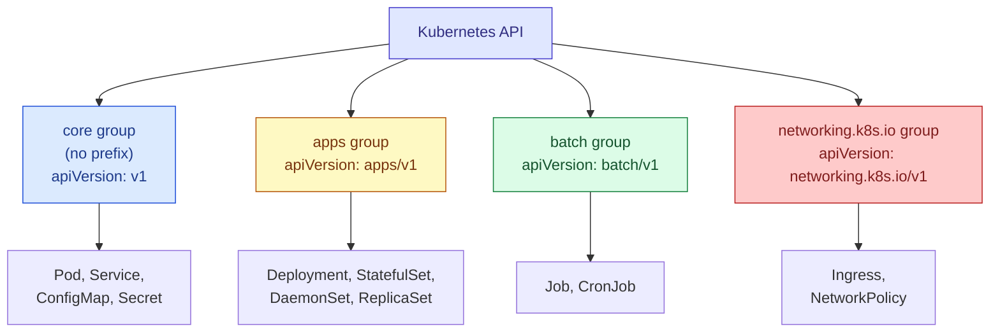

# Kubernetes API Versioning

## What `apiVersion` Actually Means

`apiVersion` isn't a version of Kubernetes itself it's the version of the **API group** that defines the `kind` you're using. Different kinds live in different groups, each versioned independently.

```
apiVersion: <group>/<version>
```

The "core" group (Pod, Service, ConfigMap, Namespace, Secret...) is special it has **no group name**, so its version is written alone as `v1`.



## The `v1alpha1` → `v1beta1` → `v1` Maturity Levels

| Stage | Stability | Should you use it? |
|---|---|---|
| `v1alpha1` | Experimental, may be buggy, may be removed entirely | No, not in production |
| `v1beta1` | Fields are mostly stable, but can still change before GA | Only if you need the feature and accept some risk |
| `v1` | Generally Available (GA) — stable, backward-compatible going forward | Yes, default choice whenever it exists |

A resource can have **multiple versions available at once** in the same cluster while it's being promoted from beta to stable — this is intentional, and lets everyone migrate gradually.

## Examples — Same Kind, Correct `apiVersion` for Each

```yaml
apiVersion: v1                # Pod is in the CORE group, so no prefix — just "v1".
kind: Pod                     # This is the object type this apiVersion applies to.
metadata:
  name: web-demo
spec:
  containers:
    - name: web-demo
      image: web-demo
```

```yaml
apiVersion: apps/v1           # Deployment lives in the "apps" group, GA at v1.
kind: Deployment               # Using "apps/v1" here is required — Deployment does
                               # NOT exist under the core "v1" group at all.
metadata:
  name: web-demo
spec:
  replicas: 3
  selector:
    matchLabels:
      app: web-demo
  template:
    metadata:
      labels:
        app: web-demo
    spec:
      containers:
        - name: web-demo
          image: web-demo:1.0
```

```yaml
apiVersion: batch/v1          # Job/CronJob live in the "batch" group.
kind: CronJob                  # Note: CronJob was "batch/v1beta1" before Kubernetes
                               # 1.21, and "batch/v1" from 1.21 onward — a real example
                               # of a version promotion you'd hit in practice.
metadata:
  name: web-demo-cleanup
spec:
  schedule: "0 * * * *"        # every hour, standard cron syntax
  jobTemplate:
    spec:
      template:
        spec:
          containers:
            - name: cleanup
              image: web-demo:1.0
              command: ["./cleanup.sh"]
          restartPolicy: OnFailure
```

## How to Find the Right `apiVersion`

```bash
# Ask kubectl directly it tells you the exact apiVersion to use for a kind
kubectl explain deployment | head -n 3
# KIND:       Deployment
# VERSION:    apps/v1

# List every apiVersion/kind combination your CURRENT cluster actually supports
# (this matters because it can differ between Kubernetes versions/distributions)
kubectl api-resources

# List just the API groups and their available versions
kubectl api-versions
```

## Why Getting This Wrong Breaks Things

```yaml
apiVersion: v1        # WRONG — Deployment isn't in the core group.
kind: Deployment
metadata:
  name: web-demo
```

Applying this fails immediately:

```
error: unable to recognize "manifest.yaml":
no matches for kind "Deployment" in version "v1"
```

Kubernetes doesn't guess the `apiVersion` and `kind` pair must exactly match something the cluster's API server actually registers. `kubectl explain <kind>` or `kubectl api-resources` are the fastest way to check before you apply.

## Key Takeaways

- `apiVersion` identifies an **API group + maturity level**, not "which Kubernetes version."
- The core group (`v1`) has no prefix; every other group does (`apps/v1`, `batch/v1`, etc.).
- Prefer `v1` (GA) over `v1beta1`/`v1alpha1` whenever a stable version exists.
- A `kind` can migrate between API versions over Kubernetes releases old manifests using a removed version will start failing after an upgrade, so it's worth revisiting older YAML when you upgrade a cluster.