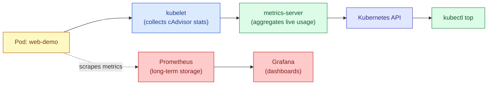

# Kubernetes Resource Monitoring

## Why It Matters

Kubernetes schedules and limits Pods based on CPU and memory. If you don't monitor actual usage against what you *requested*, you end up with two common failure modes: Pods getting **OOMKilled** (memory limit too low) or nodes running **overcommitted and unstable** (requests set too low, so the scheduler packs in more than the node can actually handle).



Two layers exist for a reason:

- **metrics-server** gives you a live, short-term snapshot (what `kubectl top` uses). No history it forgets everything after a few minutes.
- **Prometheus + Grafana** (or a managed equivalent) gives you history, alerting, and dashboards. This is what you actually want in production.

---

## Layer 1: `kubectl top` (metrics-server)

`kubectl top` needs **metrics-server** installed in the cluster it's not built in by default.


> Check if it's already installed
```bash
kubectl get deployment metrics-server -n kube-system
```
> If not, install it
```bash
kubectl apply -f https://github.com/kubernetes-sigs/metrics-server/releases/latest/download/components.yaml
```
> Current CPU/memory usage per node
```bash
kubectl top nodes
```
> NAME       CPU(cores)   CPU%   MEMORY(bytes)   MEMORY%
> node-1     420m         21%    1840Mi          46%

# Current CPU/memory usage per Pod (in the current namespace)
```bash
kubectl top pods
```
> NAME             CPU(cores)   MEMORY(bytes)
> web-demo-7d9f8b   12m          64Mi

> Same, but across all namespaces, sorted by memory
```bash
kubectl top pods --all-namespaces --sort-by=memory
```

This is a live number, not a trend useful for "is something spiking *right now*," not "how did this behave over the last week."

---

## Layer 2: Requests & Limits (what you're monitoring *against*)

Monitoring only matters if you have something to compare it to. That's what `resources` in a Pod spec is for.

```yaml
apiVersion: v1
kind: Pod
metadata:
  name: web-demo
spec:
  containers:
    - name: web-demo
      image: web-demo
      imagePullPolicy: Never  # Uses your local image without checking an online registry 
      resources:
        requests:               # what the scheduler reserves for this Pod on a node.
                                 # Used to decide WHERE the Pod can be placed.
          cpu: "100m"            # 100 millicores 0.1 of one CPU core
          memory: "128Mi"        # 128 mebibytes reserved

        limits:                 # the hard ceiling this container cannot exceed.
          cpu: "250m"            # can burst up to 0.25 of a core; CPU over this is
                                 # throttled, not killed
          memory: "256Mi"        # exceeding this gets the container OOMKilled
                                 # this is the number to watch against actual usage
```

**Monitoring goal:** compare `kubectl top pod web-demo` (actual usage) against these `requests`/`limits` numbers regularly. If actual usage is consistently far below `requests`, you're wasting cluster capacity. If it's creeping toward `limits`, you're heading for an OOMKill.

```bash
cd ..
```
```bash
cd 7.resource-monitoring
```
>create pod
```bash
kubectl apply -f monitor.yaml
```
> See both the configured limits AND live usage for a Pod in one view
```bash
kubectl describe pod web-demo | grep -A 6 "Limits\|Requests"
```
```bash
kubectl top pod web-demo
```

## Layer 3: Prometheus + Grafana (production-grade monitoring)

metrics-server has no history. For real dashboards, trends, and alerting, you need a time-series database scraping metrics continuously — Prometheus is the standard choice in the Kubernetes ecosystem.

```yaml
apiVersion: v1
kind: Pod
metadata:
  name: web-demo
  annotations:
    prometheus.io/scrape: "true"   # tells Prometheus this Pod should be scraped
    prometheus.io/port: "8080"     # which port to scrape metrics from
    prometheus.io/path: "/metrics" # which path exposes Prometheus-format metrics
spec:
  containers:
    - name: web-demo
      image: web-demo:1.0
      ports:
        - containerPort: 8080      # the app must expose a /metrics endpoint here
                                    # in Prometheus's text-based exposition format
```

The app itself needs to expose `/metrics` (most languages have a Prometheus client library that does this for you automatically request counts, latency histograms, error rates, etc.). Prometheus then scrapes that endpoint on a schedule and stores it as a time series, which Grafana visualizes.


> Quickest way to try this out on a cluster: kube-prometheus-stack via Helm
> installs Prometheus, Grafana, and Alertmanager together, pre-wired to
> scrape cluster and node metrics automatically
```bash
helm repo add prometheus-community https://prometheus-community.github.io/helm-charts
```
```bash
helm install monitoring prometheus-community/kube-prometheus-stack
```

## Setting Alerts (the point of all of this)

Dashboards are for humans watching; alerts are for when nobody's watching.

```yaml
# A PrometheusRule evaluated continuously by Prometheus, fires when true
apiVersion: monitoring.coreos.com/v1
kind: PrometheusRule
metadata:
  name: web-demo-alerts
spec:
  groups:
    - name: web-demo
      rules:
        - alert: WebDemoHighMemory
          expr: |
            container_memory_usage_bytes{pod="web-demo"} /
            container_spec_memory_limit_bytes{pod="web-demo"} > 0.9
            # fires when this Pod is using over 90% of its memory limit —
            # i.e. it's about to get OOMKilled
          for: 5m                  # must stay true for 5 minutes before firing,
                                    # avoids alerting on brief spikes
          labels:
            severity: warning
          annotations:
            summary: "web-demo is close to its memory limit"
```

## Quick Reference: What to Watch

| Signal | Command / Source | Watch for |
|---|---|---|
| Node capacity | `kubectl top nodes` | Sustained usage above ~80% |
| Pod usage vs. limits | `kubectl top pod` + `kubectl describe pod` | Usage approaching `limits.memory` (→ OOMKill risk) |
| Restarts | `kubectl get pods` | Rising `RESTARTS` count — usually crashes or OOMKills |
| Pending Pods | `kubectl get pods --field-selector=status.phase=Pending` | Cluster has no node with enough free capacity to schedule |
| Historical trends | Grafana dashboards | Slow memory growth (possible leak), CPU creeping up over days/weeks |

## Key Takeaways

- `kubectl top` needs **metrics-server** installed it's not automatic.
- `resources.requests`/`limits` on your Pods are what monitoring should be measured *against*, not just raw numbers in isolation.
- `kubectl top` is a live snapshot with no memory of history use **Prometheus + Grafana** for trends and alerting.
- Alerts should trigger on **trend toward a limit** (e.g. `for: 5m` above 90% memory), not on isolated spikes.