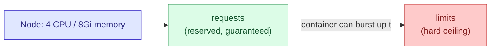

# Kubernetes Requests & Limits

## The Short Version

- **`requests`** — what a container is *guaranteed* to get. Used by the scheduler to decide which node has room for the Pod.
- **`limits`** — the *maximum* a container is allowed to use. Enforced by the kubelet at runtime.



## What Happens When You Exceed Each

| | CPU | Memory |
|---|---|---|
| Above **requests** | Fine — this is just the reserved minimum, not a cap | Fine |
| Above **limits** | Throttled (process slows down, doesn't die) | **Killed** — `OOMKilled`, then restarted per `restartPolicy` |

This asymmetry matters: CPU is *compressible* (you can just go slower), memory is not (there's nowhere for excess memory to go), so Kubernetes handles the two very differently.

## Example

```yaml
apiVersion: v1
kind: Pod
metadata:
  name: web-demo
spec:
  containers:
    - name: web-demo
      image: web-demo
      imagePullPolicy: Never  # Uses my local image without checking an online registry 
      resources:
        requests:
          cpu: "100m"        # 100 millicores = 0.1 of one CPU core.
                              # Scheduler only places this Pod on a node
                              # with at least this much CPU free.
          memory: "128Mi"     # 128 mebibytes reserved for this container.

        limits:
          cpu: "250m"        # Can burst up to 0.25 of a core. Going over
                              # just throttles the process — never killed.
          memory: "256Mi"     # Hard ceiling. Going over this gets the
                              # container OOMKilled immediately.
```
```bash
cd ..
```
```bash
cd 8.requests-and-limits
```
>create pod
```bash
kubectl apply -f requests-limits.yaml
```
> Check what a Pod actually asked for vs. what it's using right now
```bash
kubectl describe pod web-demo | grep -A4 Limits
```
> See both the configured limits AND live usage for a Pod in one view
```bash
kubectl describe pod web-demo | grep -A 6 "Limits\|Requests"
```
```bash
kubectl top pod web-demo
```
## Units Quick Reference

| Unit | Meaning |
|---|---|
| `cpu: "1"` or `cpu: "1000m"` | One full CPU core |
| `cpu: "500m"` | Half a core (500 millicores) |
| `memory: "128Mi"` | 128 mebibytes (binary, 1Mi = 1024×1024 bytes) |
| `memory: "128M"` | 128 megabytes (decimal, 1M = 1,000,000 bytes **not the same as Mi**) |

## Practical Guidance

- **Always set both.** No `requests` means the scheduler treats the Pod as needing nothing, which can overcrowd a node. No `limits` means one container can starve everything else on the node.
- **Set `requests` close to real average usage** check with `kubectl top pod`. Setting it too high wastes cluster capacity; too low risks overcommitting the node.
- **Give memory `limits` headroom** above normal usage memory can't be throttled, so a limit that's too tight causes crash loops under normal spikes.
- **If `requests` equals `limits` on every resource**, the Pod gets QoS class `Guaranteed` the most protected class, last to be evicted under node pressure.


> Check what a Pod actually asked for vs. what it's using right now
```bash
kubectl describe pod web-demo | grep -A4 Limits
```
```bash
kubectl top pod web-demo
```