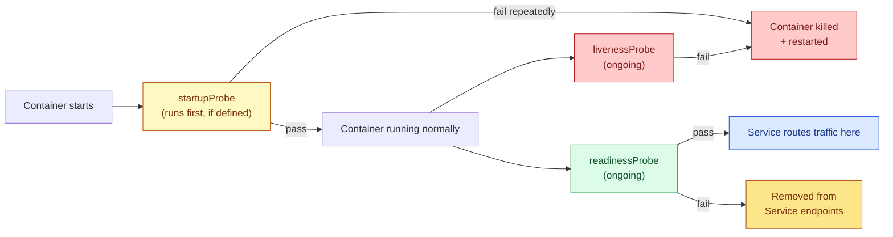

# Kubernetes Probes

## The Short Version

A **probe** is a health check the kubelet runs against a container. There are three kinds, each answering a different question:

| Probe | Question it answers | On failure |
|---|---|---|
| **livenessProbe** | "Is this container still alive/healthy?" | Container is **killed and restarted** |
| **readinessProbe** | "Is this container ready to receive traffic?" | Pod is pulled **out of Service endpoints** — no restart |
| **startupProbe** | "Has this container finished starting up yet?" | Container is **killed and restarted** (but liveness/readiness are paused until this passes) |



## Why Readiness and Liveness Are Different

This trips people up constantly: **a container can be alive but not ready.** A container that's temporarily overloaded, still warming a cache, or waiting on a slow dependency is alive restarting it would make things worse, not better. But you don't want traffic sent to it either. That's exactly the case readiness solves without triggering a restart.

## Example

```yaml
apiVersion: v1
kind: Pod
metadata:
  name: web-demo
spec:
  containers:
    - name: web-demo
      image: web-demo
      imagePullPolicy: Never  # Uses my local image without checking an online registry
      ports:
        - containerPort: 8080

      startupProbe:                # Runs FIRST. Liveness/readiness don't start
                                    # checking until this passes even once protects
                                    # slow-booting apps from being killed prematurely.
        httpGet:
          path: /healthz
          port: 8080
        failureThreshold: 30        # allow up to 30 failed checks...
        periodSeconds: 2            # ...at 2s apart = up to 60s to boot before
                                    # it's considered a failed startup

      readinessProbe:               # Controls whether this Pod receives traffic.
        httpGet:
          path: /ready               # often a DIFFERENT endpoint than liveness
          port: 8080                 # can check "are my dependencies reachable?"
        initialDelaySeconds: 3
        periodSeconds: 5             # check every 5s
        failureThreshold: 3          # 3 consecutive failures = marked NotReady,
                                      # pulled out of Service routing (no restart)

      livenessProbe:                # Controls whether this container gets killed.
        httpGet:
          path: /healthz             # usually a LIGHTWEIGHT check just "is the
          port: 8080                 # process responding at all," not full health
        initialDelaySeconds: 10
        periodSeconds: 10
        failureThreshold: 3          # 3 consecutive failures = container restarted
```
```bash
cd ..
```
```bash
cd 9.probs
```
>create pod
```bash
kubectl apply -f prob.yaml
```

> See current probe results and recent restart history
```bash
kubectl describe pod web-demo
```

## Probe Mechanisms (all three types support these)

```yaml
apiVersion: v1
kind: Pod
metadata:
  name: web-demo
spec:
  containers:
    - name: web-demo
      image: web-demo:1.0
      ports:
        - containerPort: 8080

      # Option A — check via HTTP (most common for web apps)
      readinessProbe:
        httpGet:                # <- the mechanism goes nested inside the probe
          path: /ready
          port: 8080
        periodSeconds: 5

      # Option B — check via raw TCP connection (no HTTP endpoint needed,
      # good for things like databases, message queues)
      livenessProbe:
        tcpSocket:               # <- swapped in instead of httpGet
          port: 8080
        periodSeconds: 10

      # Option C — check via running a command inside the container
      startupProbe:
        exec:                    # <- swapped in instead of httpGet/tcpSocket
          command: ["cat", "/tmp/healthy"]
        failureThreshold: 30
        periodSeconds: 2
```

## Common Mistakes

| Mistake | Consequence |
|---|---|
| Using the same heavy endpoint for liveness as readiness | A slow dependency check failing kills the container instead of just pulling it from traffic |
| No `startupProbe` on a slow-booting app | `livenessProbe`'s `initialDelaySeconds` has to be set way too high, delaying real crash detection later |
| `failureThreshold`/`periodSeconds` too aggressive | Restarts under brief, harmless load spikes — flapping containers |
| No probes at all | Kubernetes assumes the container is instantly ready the moment it starts — traffic can hit it before it's actually able to serve |

## Key Takeaways

- `readinessProbe` = traffic control, no restart. `livenessProbe` = restart control.
- Add a `startupProbe` for anything slow to boot instead of inflating `livenessProbe`'s initial delay.
- Keep the liveness check cheap and local; put dependency checks in readiness instead.
