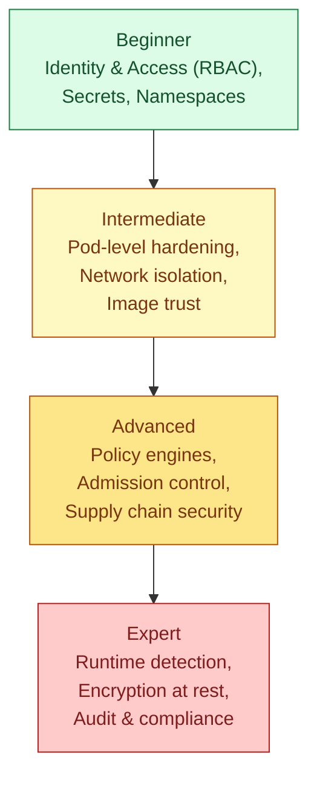

# Kubernetes Security, From Beginner to Expert

## How to Read This Document

Kubernetes security isn't one topic — it's a stack of separate layers, each addressing a different question about who can do what, and each one only as strong as the layers underneath it. This document is organized deliberately as a progression, starting with the things that matter for almost any cluster on day one, moving through the things a growing team needs to get right as more people and more workloads share a cluster, and ending with the practices that come up specifically at real scale, in regulated environments, or under serious threat models. Each section builds on an assumption that the ones before it are already in place, so working through it roughly in order will make more sense than jumping straight to the end.



---

# Beginner Level

## Understanding "Who Can Do What": RBAC

Every request to the Kubernetes API — whether it comes from a human running `kubectl`, or from something running inside a Pod — has to be both **authenticated** (Kubernetes needs to know who is making this request) and **authorized** (Kubernetes needs to decide whether that identity is actually allowed to do what it's asking to do). The authorization mechanism almost every cluster uses for this is **Role-Based Access Control**, usually just called RBAC, and understanding it properly is the single highest-leverage thing to get right early, because almost every other security mistake in Kubernetes becomes far more dangerous when combined with overly broad RBAC permissions.

RBAC works through four connected object types, and it's worth being precise about how they relate to each other, because the terminology overlaps in a way that causes genuine confusion the first time through. A **Role** defines a set of permissions — which actions (verbs like `get`, `list`, `create`, `delete`) are allowed on which kinds of objects — but a Role only applies within a single namespace. A **ClusterRole** defines the same kind of permission set, but it isn't tied to any one namespace; it can be applied cluster-wide, or bound to a specific namespace when that's more convenient than writing an equivalent Role by hand. Neither a Role nor a ClusterRole grants anything to anyone by itself — they're purely definitions of *what a set of permissions looks like*, sitting unused until something connects them to an actual identity. That connection is made by a **RoleBinding** (which grants a Role's or ClusterRole's permissions within one specific namespace) or a **ClusterRoleBinding** (which grants a ClusterRole's permissions across the entire cluster).

```yaml
apiVersion: rbac.authorization.k8s.io/v1
kind: Role
metadata:
  namespace: web-demo
  name: web-demo-pod-reader
rules:
  - apiGroups: [""]
    # The core API group is represented as an empty string here — this
    # is a quirk of the API worth just memorizing rather than being
    # confused by every time you see it.
    resources: ["pods"]
    verbs: ["get", "list", "watch"]
    # This identity can look at Pods in this namespace, but this Role
    # grants nothing else at all — no creating, editing, or deleting
    # anything, and no visibility into any other kind of object.
---
apiVersion: rbac.authorization.k8s.io/v1
kind: RoleBinding
metadata:
  name: web-demo-pod-reader-binding
  namespace: web-demo
subjects:
  - kind: ServiceAccount
    name: web-demo-monitoring
    namespace: web-demo
    # This grants the permissions above to a specific ServiceAccount
    # (identities used by things running inside the cluster, covered
    # next), rather than to a human user directly — though a
    # RoleBinding can just as easily target a human user or a group
    # instead.
roleRef:
  kind: Role
  name: web-demo-pod-reader
  apiGroup: rbac.authorization.k8s.io
```

The principle to hold onto throughout all of this is the **principle of least privilege**: grant exactly the permissions something needs to do its job, and nothing more. It's tempting, especially early on, to reach for a broad ClusterRole like `cluster-admin` to make something work quickly and move on, but that single decision is responsible for an enormous share of real Kubernetes security incidents, because it means that if anything using that identity is ever compromised — a vulnerability in the application itself, a leaked credential, a supply-chain issue in a dependency — the blast radius of that compromise is the entire cluster, rather than one narrowly-scoped set of permissions in one namespace.

## Identities for Things Running Inside the Cluster: ServiceAccounts

A **ServiceAccount** is Kubernetes' answer to a specific question: when a Pod's own code needs to talk back to the Kubernetes API itself — to list other Pods, read a ConfigMap, or anything else — what identity is it using to do that, given that it obviously isn't a human logging in with their own credentials? Every Pod runs under some ServiceAccount, and if you don't specify one explicitly, it automatically runs under a `default` ServiceAccount that exists in every namespace.

This default behavior is worth understanding clearly, because it's a common source of unnecessary exposure. Historically, every Pod automatically had a token for its ServiceAccount mounted into its filesystem, whether or not the application inside that Pod ever actually needed to talk to the Kubernetes API at all. If that Pod's own default ServiceAccount happened to have any permissions bound to it — even accidentally, through an overly broad RoleBinding applied for something else — anything able to read files inside that Pod could potentially use that mounted token to act as that ServiceAccount against the API.

```yaml
apiVersion: v1
kind: Pod
metadata:
  name: web-demo
spec:
  serviceAccountName: web-demo-app
  # Explicitly naming a dedicated ServiceAccount for this specific
  # application, rather than relying on the shared "default" one for
  # the whole namespace, makes it possible to reason clearly about
  # exactly what permissions this one application actually has.
  automountServiceAccountToken: false
  # If this Pod's own code genuinely never needs to call the
  # Kubernetes API itself — true for the large majority of ordinary
  # application Pods — explicitly disabling this removes a token from
  # the container's filesystem that would otherwise sit there unused,
  # simply reducing what's available to anything that might end up
  # running unexpected code inside this container later.
  containers:
    - name: web-demo
      image: web-demo:1.0
```

## Isolation Boundaries: Namespaces (a Recap)

Namespaces are covered in their own dedicated notes, but it's worth restating the security-relevant part plainly here: a Namespace is an organizational and RBAC-scoping boundary, not a network or a kernel-level security boundary on its own. RBAC Roles and RoleBindings are scoped to a namespace, which is genuinely useful — it lets you grant a team full control within their own namespace without touching anyone else's — but Pods in different namespaces can still reach each other freely over the network by default, exactly as described in the networking notes, unless NetworkPolicies are deliberately configured to prevent it. Treating "put it in its own namespace" as sufficient isolation on its own is a common and understandable mistake worth actively correcting.

## Keeping Sensitive Values Out of Plain Text: Secrets (a Recap)

The dedicated notes on Secret management cover this fully, including the important point that a Secret is base64-encoded, not encrypted, by default. The beginner-level takeaway worth repeating here specifically in a security context: never put real credentials directly into a ConfigMap, an environment variable defined in plain YAML committed to version control, or baked into a container image. Use a Secret as the absolute minimum baseline, and be aware from the start that a Secret alone is not a strong guarantee — the more advanced sections below build directly on this.

---

# Intermediate Level

## Constraining What a Container Is Allowed to Do: `securityContext`

Beyond RBAC governing what a Pod's identity can do *to the Kubernetes API*, there's a separate and equally important question: what is a container allowed to do *on the machine it's running on*, at the operating system level? By default, a container can run as the root user, and depending on the runtime configuration, might have more low-level system privileges available to it than a typical application genuinely needs. A `securityContext` lets you constrain this deliberately, at either the Pod level or the individual container level.

```yaml
apiVersion: v1
kind: Pod
metadata:
  name: web-demo
spec:
  securityContext:
    runAsNonRoot: true
    # Refuses to even start this Pod's containers if the resulting
    # image would otherwise run as root — forcing this to be caught
    # and fixed rather than silently running with more privilege than
    # intended.
    runAsUser: 1000
    # Explicitly runs the container's process as this specific,
    # non-root user ID, rather than whatever user the image itself
    # defaults to.
    fsGroup: 2000
    # Any volumes mounted into this Pod will be owned by this group
    # ID, which matters when the application needs to read or write
    # files without running as root.

  containers:
    - name: web-demo
      image: web-demo:1.0
      securityContext:
        allowPrivilegeEscalation: false
        # Prevents this specific container's process from gaining
        # MORE privileges than it started with, closing off a
        # category of privilege-escalation techniques that rely on
        # a process being able to elevate itself after starting.
        readOnlyRootFilesystem: true
        # Makes the container's own filesystem read-only, meaning
        # even a fully compromised application running inside it
        # cannot write malicious files anywhere on that filesystem,
        # persist anything, or tamper with its own binaries. Any
        # directory the application genuinely needs to write to
        # (temp files, a cache) has to be explicitly provided as a
        # writable volume mount instead, which is a deliberate,
        # visible decision rather than an accidental default.
        capabilities:
          drop:
            - ALL
          # Linux capabilities are fine-grained pieces of what "root"
          # traditionally means, bundled into individually
          # revocable permissions. Dropping ALL of them removes
          # every one by default, and any specific capability the
          # application genuinely needs (rare in practice for most
          # ordinary web applications) would then be added back
          # individually and deliberately under an "add" list here,
          # rather than the container simply having all of them by
          # default the way an unconfigured container typically does.
```

## Restricting These Settings Cluster-Wide: Pod Security Admission

Setting a good `securityContext` on every single Pod manifest by hand relies entirely on every person writing manifests remembering to do it correctly every time, which doesn't scale as a strategy once more than a couple of people are creating workloads in a cluster. **Pod Security Admission** is a built-in Kubernetes mechanism that enforces baseline security requirements at the namespace level, rejecting any Pod that doesn't meet the standard, rather than relying on convention or trust that everyone remembered.

```yaml
apiVersion: v1
kind: Namespace
metadata:
  name: web-demo
  labels:
    pod-security.kubernetes.io/enforce: restricted
    # "restricted" is the strictest of the three built-in Pod Security
    # Standards levels — it requires things like running as
    # non-root, dropping all Linux capabilities, and disallowing
    # privilege escalation, refusing to even create a Pod that
    # doesn't comply, rather than allowing it and merely noting a
    # warning. The other two levels are "baseline" (blocks the most
    # obviously dangerous configurations, such as running fully
    # privileged) and "privileged" (no restriction at all — meant
    # for workloads that genuinely need broad system access, such as
    # certain cluster infrastructure components themselves).
    pod-security.kubernetes.io/warn: restricted
    # A separate, non-blocking setting: still allows a
    # non-compliant Pod to be created, but surfaces a warning to
    # whoever ran the command, which is useful while migrating an
    # existing namespace toward a stricter standard without breaking
    # things immediately.
```

## Trusting What You Actually Run: Image Security

A cluster can have flawless RBAC and a perfectly hardened `securityContext` on every Pod, and still be seriously compromised if the container image itself contains a known vulnerability, or worse, was never something you should have trusted to run in the first place. A few concrete practices matter here. Pin image tags to a specific version rather than `latest`, both for the reproducibility reasons covered elsewhere and because `latest` makes it impossible to know exactly what code is actually running at any given moment, which matters enormously when trying to determine whether a newly disclosed vulnerability actually affects you. Pull images only from registries you've deliberately decided to trust, rather than allowing arbitrary public images to be used in production namespaces — this can be enforced later with the policy engines covered in the advanced section. Scan images for known vulnerabilities as part of your build pipeline, using a tool such as Trivy, Grype, or a cloud provider's built-in scanning service, and treat a scan finding critical, actively exploited vulnerabilities as something that blocks a deployment, not just something that gets logged somewhere nobody reads.

```yaml
apiVersion: v1
kind: Pod
metadata:
  name: web-demo
spec:
  imagePullSecrets:
    - name: web-demo-registry-creds
      # If pulling from a private registry, this references a Secret
      # of type kubernetes.io/dockerconfigjson (covered in the
      # dedicated Secrets notes), which is itself a small but
      # important piece of image trust: only Pods that have this
      # credential can pull this image at all, rather than the
      # image being pullable by anyone who discovers its name.
  containers:
    - name: web-demo
      image: registry.example.com/web-demo:1.0
      # Pinned to a specific tag, from a specifically named,
      # deliberately trusted registry — not "latest", and not from
      # an arbitrary public registry nobody made a conscious
      # decision to trust.
```

## Locking Down Traffic Between Workloads: NetworkPolicy (a Recap)

The dedicated networking notes cover NetworkPolicy mechanics in full, including the crucial fact that Kubernetes allows all Pod-to-Pod traffic by default, and that a NetworkPolicy must exist and specifically select a Pod before any restriction applies to it at all. In a security-focused reading of that same mechanism, the practical recommendation is to move toward a **default-deny** posture in any namespace running anything sensitive: apply a NetworkPolicy that selects every Pod in the namespace and permits nothing by default, then add narrowly-scoped policies on top that explicitly allow only the specific traffic each workload genuinely needs.

```yaml
apiVersion: networking.k8s.io/v1
kind: NetworkPolicy
metadata:
  name: default-deny-all
  namespace: web-demo
spec:
  podSelector: {}
  # An empty selector here means "every Pod in this namespace,"
  # rather than some specific subset of them.
  policyTypes:
    - Ingress
    - Egress
  # With no "ingress" or "egress" rules listed at all beneath this,
  # every Pod in this namespace now accepts NOTHING and can reach
  # NOTHING, by default, until other, more specific NetworkPolicies
  # are layered on top to deliberately open up exactly what's needed.
```

---

# Advanced Level

## Enforcing Custom Rules Kubernetes Doesn't Know About Natively: Policy Engines

Pod Security Admission, covered above, enforces a fixed, built-in set of standards. Real organizations very often need rules that go well beyond that fixed set — "every image must come from our approved internal registry," "every Deployment must define resource requests and limits," "no Service of type LoadBalancer is allowed outside the ingress namespace" — and these organization-specific rules require a general-purpose **policy engine**, most commonly either **OPA Gatekeeper** or **Kyverno**, both of which work by intercepting requests to the Kubernetes API (through a mechanism called admission control, covered in more detail next) and rejecting anything that violates a rule you've defined.

```yaml
# A Kyverno policy, chosen here for its more directly readable YAML
# syntax compared to Gatekeeper's Rego-based policies, though both
# accomplish fundamentally the same goal.
apiVersion: kyverno.io/v1
kind: ClusterPolicy
metadata:
  name: require-resource-limits
spec:
  validationFailureAction: Enforce
  # "Enforce" blocks a non-compliant object from being created at
  # all. The alternative, "Audit", allows it through but records a
  # policy violation — genuinely useful as a first step when rolling
  # out a new rule against an existing cluster, to see what WOULD
  # have been blocked before actually blocking anything.
  rules:
    - name: check-resources
      match:
        any:
          - resources:
              kinds:
                - Pod
      validate:
        message: "Every container must define CPU and memory limits."
        pattern:
          spec:
            containers:
              - resources:
                  limits:
                    cpu: "?*"
                    memory: "?*"
                    # The "?*" pattern requires the field to exist and
                    # be non-empty, without dictating a specific value
                    # — this is checking that resource limits from
                    # the earlier notes on requests and limits are
                    # actually being set, cluster-wide, rather than
                    # trusting every team to remember on their own.
```

## The Mechanism Underneath All of This: Admission Control

It's worth understanding, at least at a conceptual level, what actually makes Pod Security Admission and policy engines like Kyverno or Gatekeeper possible at all, because it's the same underlying mechanism in both cases. Every request to create or modify an object in the Kubernetes API passes through a pipeline of **admission controllers** after authentication and RBAC authorization succeed, but before the object is actually persisted. Some admission controllers are built directly into Kubernetes itself and always run; others, called **dynamic admission webhooks**, are how external tools like Kyverno and Gatekeeper plug themselves into this exact same pipeline, receiving a copy of every incoming request, and returning either an approval or a rejection with an explanation, which is precisely how a policy engine is able to block a non-compliant Pod before it's ever actually created, rather than only detecting a problem afterward.

## Trusting the Software Supply Chain Itself

Beyond scanning an image for known vulnerabilities, covered at the intermediate level, a more thorough approach asks a more fundamental question: how do you actually know this image is what it claims to be, and that it wasn't tampered with somewhere between being built and being pulled onto a node? **Image signing**, using a tool such as Cosign (part of the broader Sigstore project), lets you cryptographically sign an image at build time, and then enforce, via a policy engine's admission webhook, that only images with a valid signature from a trusted key are ever allowed to run in the cluster at all. A **Software Bill of Materials (SBOM)**, generated at build time and often signed alongside the image itself, gives you a complete, precise inventory of every package and library that actually went into an image, which becomes enormously valuable the moment a new vulnerability is disclosed in some widely-used library: rather than manually checking every image you run, you can query your SBOMs directly to know immediately, with certainty, exactly which of your running images are actually affected.

## Storing Secrets Somewhere Genuinely More Robust Than etcd

The Secrets notes already cover why a base64-encoded value stored directly in the cluster isn't strong protection on its own. At an advanced level, many organizations move the actual sensitive values out of Kubernetes' own storage entirely, using a dedicated external secrets manager — HashiCorp Vault, AWS Secrets Manager, GCP Secret Manager, or similar — with something like the **External Secrets Operator** running inside the cluster to fetch the real value from that external system at runtime and materialize it as a normal-looking Kubernetes Secret object that Pods can still consume exactly as described in the Secrets notes. This adds a genuinely independent layer of access control, auditing, and rotation that lives outside of, and doesn't rely entirely on, whatever level of access someone might have to the Kubernetes cluster itself.

---

# Expert Level

## Detecting Malicious Behavior While It's Happening: Runtime Security

Everything covered so far is about *preventing* something bad from being deployed in the first place — RBAC, admission control, image trust. None of it helps if something bad is already running, whether through a vulnerability that slipped past every earlier layer, or a legitimate credential that's been compromised. **Runtime security** tools, most notably **Falco**, address this different problem by watching actual system-call-level behavior happening inside running containers, in real time, and alerting — or in some configurations, actively blocking — behavior that matches a known-suspicious pattern: a shell being spawned unexpectedly inside a container that should never spawn one, a process attempting to read sensitive files like `/etc/shadow` from inside a container, an outbound connection to a known-malicious IP address, and so on. This is the layer that assumes every earlier layer might eventually fail, and asks "if something bad is happening right now, will anything actually notice?"

## Protecting Data Kubernetes Itself Stores: Encryption at Rest

Everything Kubernetes knows about your cluster — every object, every Secret, every ConfigMap — is stored in **etcd**, the cluster's own backing datastore. By default, this data, including Secrets, is stored in etcd unencrypted at the storage layer; the base64 encoding covered earlier is not encryption at rest, and someone with direct access to etcd's underlying storage (a disk snapshot, a backup file, physical access to the storage medium) could read Secret values directly without ever going through the Kubernetes API or its RBAC checks at all. **Encryption at rest**, configured on the API server itself, ensures that data is encrypted before it's ever written to etcd's storage, meaning a raw copy of that storage on its own is no longer sufficient to recover the actual sensitive values. Most managed Kubernetes offerings from major cloud providers now enable at least a baseline form of this by default, but it's genuinely worth confirming explicitly for any cluster handling sensitive data, rather than assuming it's already the case.

## Knowing What Actually Happened: Audit Logging

Kubernetes can be configured to keep a detailed **audit log** of every single request made to the API server — who made it, what it targeted, whether it succeeded, and what the request and response actually contained, depending on the configured verbosity level. This is the layer that turns "we think something bad might have happened" into "we can prove exactly what happened, when, and by whom," which matters enormously both for genuinely investigating a suspected incident after the fact, and for satisfying compliance requirements that specifically mandate this kind of traceable record. Configuring an audit policy thoughtfully matters here — logging absolutely everything at full request-and-response detail generates an enormous, expensive volume of data, so a well-designed policy typically logs sensitive or destructive operations (deleting objects, reading Secrets, RBAC changes) at high detail, while logging routine, low-risk read operations far more sparingly or not at all.

## Isolating Workloads More Strongly Than Namespaces Alone Can

At real scale, particularly when running genuinely untrusted or multi-tenant workloads in a shared cluster, the isolation that Namespaces plus RBAC plus NetworkPolicy provide can still fall short, because all of those mechanisms ultimately still share the same underlying Linux kernel on each node, and a sufficiently severe container-escape vulnerability could, in principle, allow one tenant's workload to affect another's, or the node itself, regardless of how carefully everything above has been configured. Sandboxed container runtimes, such as **gVisor** or **Kata Containers**, address this by running each container with a substantially stronger isolation boundary than a standard container provides — either through a userspace kernel that intercepts and re-implements system calls (gVisor's approach) or by running each container inside its own lightweight virtual machine (Kata's approach) — specifically for situations where the workloads sharing a cluster genuinely cannot fully trust each other, and where a kernel-level compromise would be an unacceptable outcome.

## Measuring Against a Known Standard: CIS Benchmarks and Compliance Scanning

Rather than relying purely on institutional knowledge of best practices, the **CIS (Center for Internet Security) Kubernetes Benchmark** provides an extremely detailed, versioned, publicly available checklist covering the correct, secure configuration of every major Kubernetes component — the API server, etcd, the kubelet, and more — down to specific configuration flags and their recommended values. Tools such as `kube-bench` can run this entire benchmark against a real cluster automatically and produce a pass/fail report for every individual check, which is genuinely useful both as an ongoing health check for a cluster you already run, and as a starting checklist when standing up a new one, rather than trying to independently rediscover the same hardening knowledge from scratch.

---

# Pulling the Whole Progression Together

| Level | Core question being answered | Key mechanisms |
|---|---|---|
| Beginner | Who is allowed to do what? | RBAC, ServiceAccounts, Namespaces, basic Secrets |
| Intermediate | What is a container allowed to do, and where did it come from? | `securityContext`, Pod Security Admission, image scanning, default-deny NetworkPolicy |
| Advanced | How do we enforce our own rules, and trust the software we run? | Policy engines (Kyverno/Gatekeeper), admission webhooks, image signing, external secrets managers |
| Expert | What happens if every earlier layer fails, and can we prove it? | Runtime detection (Falco), encryption at rest, audit logging, sandboxed runtimes, CIS benchmarking |

No single item on this list is optional in the sense of "expert clusters need it and beginner clusters don't" — a small team running one application still benefits enormously from getting the beginner-level items right from day one, since RBAC mistakes and unencrypted secrets are just as damaging in a small cluster as a large one. What genuinely changes as you move down this list is less about severity and more about scale and threat model: the advanced and expert practices become necessary specifically once you have many people, many teams, genuinely untrusted workloads, or a regulatory obligation to prove your security posture rather than simply believe in it.